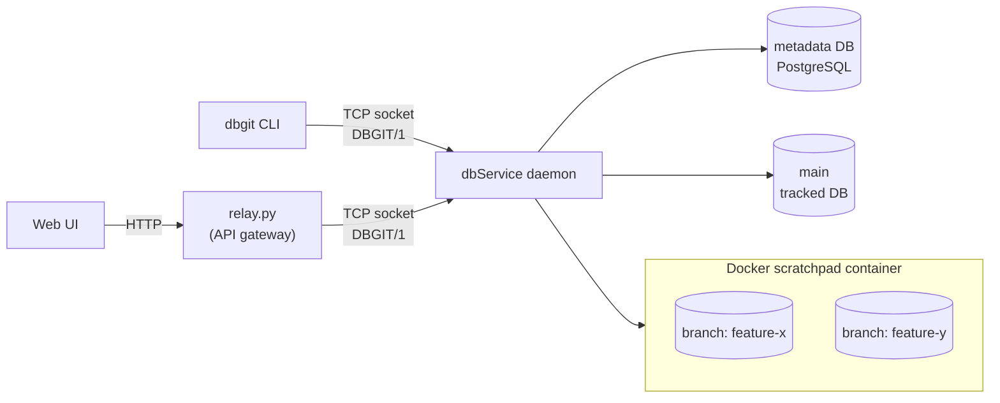

# dbgit

Git for your database schema — with a real database behind every branch.

## What it is

Your application code has branches, history, diffs and merges. Your schema usually has a folder of
migration scripts and a convention about who is allowed to run them. `dbgit` closes that gap.

```bash
./dbgit checkout -b add-invoices                     # a real, private database, forked in seconds
echo "CREATE TABLE invoices (id SERIAL, total NUMERIC(10,2));" | ./dbgit add
./dbgit commit -m "invoices table"
./dbgit diff main add-invoices                       # what changed, column by column
./dbgit merge add-invoices                           # bring it back, or be told exactly why not
```

`checkout -b` doesn't create a file. It creates a **running database** — an independent PostgreSQL
(or MySQL, or in-memory H2) database, built by replaying that branch's history from the beginning.
You can connect to it, break it, load data into it, point your app at it, and throw it away. Every
developer gets their own; nobody waits for the shared staging box.

## Why it's different

**A branch is a database, not a diff.** Schema-diff tools compare two databases after the fact.
Migration frameworks give you an ordered list of scripts and hope everyone ran them. `dbgit` gives
each branch its own live database and rebuilds it from history whenever it needs to — so "what does
this branch's schema actually look like?" is answered by a database you can query, not by reading
files and guessing.

**History is the source of truth, so branches are reproducible.** `dbgit` never introspects a
database to learn what's in it. A schema is only ever what its recorded DDL says it is, which is why
forking a branch, merging one, and rolling one back with `reset` all reduce to the same reliable
operation: replay this history into an empty database. There is no drift to reconcile, because
there is nothing to reconcile against.

**Merges that understand renames.** Every table and column carries a stable identity that survives
being renamed. `ALTER TABLE users RENAME COLUMN email TO contact_email` reads as *one column that
moved* — not as one column vanishing and another appearing — and an index over that column follows
it automatically.

**Conflicts judged three ways, like git.** Two branches describing a column differently isn't a
conflict; it's usually one branch not having caught up yet. `dbgit` replays the history the two
branches *share* and asks which side actually moved the column. Only if both did is the merge
refused — and it tells you which column, which constraint, which index, with both sides' statements
side by side. Write the statement that resolves it and the merge goes through.

**A merge is rehearsed before it touches anything real.** Every merge first forks a throwaway
staging database and replays the incoming changes there. Only once that succeeds for real does it
touch your branch's database — and the staging branch is cleaned up either way.

**Bad DDL is caught before it reaches the database.** `dbgit add` parses and validates every
statement against the dialect you configured, so a MySQL-only statement on a Postgres branch is
rejected at the point you typed it. And anything `dbgit` cannot faithfully model — an inline
`PRIMARY KEY` in a `CREATE TABLE`, say — is refused with the statement to write instead, rather than
silently accepted and quietly invisible to every later diff.

**Built for a team, not one laptop.** `dbgit` runs as a daemon serving many people at once. It keeps
no per-user state of its own — each client carries its own branch and credentials — and every
operation that changes a branch is serialized through a database-level lock, taken in a fixed order
so that two people merging in opposite directions can't deadlock each other. Reads never wait for
writes. An operation that fails halfway cleans up after itself instead of leaving a half-built
branch behind.

**One branch is not a scratchpad.** `main` tracks a real, pre-existing database you point it at with
`dbgit init` — your actual production or staging schema. Everything else forks. Credentials for it
stay in your own workspace and are never written to shared storage.

## Architecture



One daemon, many clients, no per-user state on the server — each request carries its own branch and
credentials over its own socket. The metadata DB is the only source of truth for what branches and
commits exist; every branch database (`main`'s tracked one included) is rebuilt from it by replay,
never read back into it. The web UI never talks to the daemon directly — `relay.py` is a thin
HTTP-to-TCP gateway in front of it, since a browser can't open a raw socket.

## Command summary

- `dbgit init` — point `main` at the real database it tracks
- `dbgit checkout -b <branch>` — fork a real, independent database from the current branch's history
- `dbgit add` — stage one DDL statement (from stdin) and apply it to the branch's live database
- `dbgit commit -m <message>` — fold staged changes into the branch's history
- `dbgit diff <a> <b>` — compare two branches, table by table and column by column
- `dbgit log` — a branch's commits, plus whatever is staged but uncommitted
- `dbgit merge <branch>` — merge another branch in, refusing genuine conflicts
- `dbgit reset <commit>` — take a branch back to a commit, rebuilding its database
- `dbgit branch` — list branches

Works against PostgreSQL, MySQL, or in-memory H2 branch databases — same commands, same model.

## What's supported

### SQL statements `dbgit add` accepts

`dbgit` models a schema itself, so it accepts a deliberately small, precisely defined set of DDL.
Everything below is parsed into the internal model, replayed on every fork, and understood by `diff`
and `merge`. Anything not on this list is rejected at `dbgit add` time, before it reaches a database.

| Statement | PostgreSQL / H2 | MySQL |
|---|---|---|
| Create a table (columns only) | `CREATE TABLE t (c1 …, c2 …)` | same |
| Drop a table | `DROP TABLE t` | same |
| Rename a table | `ALTER TABLE t RENAME TO u` | same — MySQL's own `RENAME TABLE t TO u` is not accepted; write it as `ALTER TABLE` |
| Add a column | `ALTER TABLE t ADD COLUMN c <type> …` | same |
| Drop a column | `ALTER TABLE t DROP COLUMN c` | same |
| Rename a column | `ALTER TABLE t RENAME COLUMN a TO b` | same |
| Change a column's type | `ALTER TABLE t ALTER COLUMN c TYPE <type>` (a trailing `USING <expr>` is accepted and ignored) | `ALTER TABLE t MODIFY COLUMN c <type>` |
| Add a constraint | `ALTER TABLE t ADD CONSTRAINT n PRIMARY KEY (…)` / `UNIQUE (…)` / `FOREIGN KEY (…) REFERENCES …` | same |
| Drop a constraint | `ALTER TABLE t DROP CONSTRAINT n` | same |
| Create an index | `CREATE [UNIQUE] INDEX n ON t (c1, c2)` | same |

A table rename is **tracked as a rename**, not read back as a drop plus an add: the table keeps its
identity across the statement, so `dbgit diff` shows one table whose name differs, and every column,
constraint and index it carries survives untouched. `dbgit merge` can therefore bring in a one-sided
rename cleanly, and reports a genuine conflict — both branches renamed the same table — as a
table-level conflict, the same way it already does for a column.

Inside a column definition, `NOT NULL`, `DEFAULT <value>` and the dialect's identity spelling
(`GENERATED ALWAYS/BY DEFAULT AS IDENTITY` on PostgreSQL, `AUTO_INCREMENT` on MySQL, either on H2)
are all understood and tracked. `SERIAL` and friends are just types, and pass through as written.

Each dialect's parser is **strict to its own dialect**: a MySQL `MODIFY COLUMN` on a PostgreSQL
branch is rejected when you type it, rather than accepted and left to fail later during a fork or a
merge.

### What is deliberately rejected, and why

| Rejected | Reason |
|---|---|
| A constraint declared inside `CREATE TABLE` — inline (`id INT PRIMARY KEY`, `email TEXT UNIQUE`, `… REFERENCES other(id)`) or table-level (`, PRIMARY KEY (id)`) | These used to be silently ignored: the constraint existed in the real database but not in the model, invisible to `diff` and missing from every later fork. The error names the `ALTER TABLE … ADD CONSTRAINT` to write instead. |
| `CHECK` constraints | Not modelled — there is nowhere in `ConstraintType` for them to live. |
| `DROP INDEX` (in any spelling) | An index name carries no table, and `dbgit` rebuilds a schema by replaying history one table at a time, so it cannot tell whose index it was. Drop the constraint that owns it instead. |
| `IF EXISTS` / `IF NOT EXISTS`, on any statement | A statement must mean the same thing every time it is replayed. A conditional clause means one thing on a branch that has the object and nothing on one that does not. |
| `DROP TABLE … CASCADE` | Can silently drop constraints on *other* tables that replay never sees and `dbgit diff` can never report. Drop the referencing constraint first. |
| `DROP TABLE` naming several tables at once, or a `TEMPORARY` table | Not modelled. |
| Index types other than plain and `UNIQUE` | Not modelled. |
| Several changes in one `ALTER TABLE` (`ADD a INT, ADD b INT`) | One statement, one change — that is the unit a changeset, a diff and a conflict are all expressed in. Write them as two. |
| `RENAME TABLE t TO u` (MySQL's own spelling) | `ALTER TABLE t RENAME TO u` covers every dialect, so only that form is accepted. |
| Views, sequences, triggers, functions, stored procedures, schemas other than `public` | Not modelled yet. See "extending" below. |
| Any DML (`INSERT`, `UPDATE`, `DELETE`), and data generally | Out of scope: `dbgit` versions schema. Load data into a branch's database directly — it is a normal database. |

### Databases

| Role | Supported | Notes |
|---|---|---|
| **Branch databases** (what your schema actually lives in) | PostgreSQL, MySQL, H2 | Set `branchDatabases.dialect` in `dbgit.json`. PostgreSQL and MySQL run in a shared Docker container `dbgit` manages; H2 is in-memory inside the daemon and needs no Docker at all. |
| **The database `main` tracks** | Same dialect as above | A real, pre-existing database you point at with `dbgit init`. |
| **`dbgit`'s own metadata store** | PostgreSQL only | Not configurable. It uses jOOQ pinned to the Postgres dialect, Postgres DDL, and Postgres advisory locks for branch locking. |

### Easy to extend

These are the seams the design already has. Each is a small, local change:

- **Another SQL dialect.** Two halves, registered together in `ConnectorRegistry`: a `JdbcConnections`
  that builds that vendor's URL, and a `SqlConnector` that runs raw SQL. Then a `DialectGrammar` value
  — how it spells a retype and what its identity columns look like — registered in
  `DdlParserRegistry`. Add a `ContainerSpec` if branch databases for it should run in Docker; omit it
  (as H2 does) if they should not. No existing logic changes.
- **Another DDL statement that edits one table.** Add a `SchemaOperation` variant, a branch in
  `SqlDdlParser`, and the matching edit in `SchemaOperationApplier`. Everything downstream — replay,
  fork, diff, merge, reset — picks it up for free, because they all work in terms of the model rather
  than the SQL. `DROP TABLE`/`RENAME TO` are the one exception worth knowing about: they're the first
  two operations whose effect is on the schema as a whole rather than on a single table, so they also
  needed `Replayer.apply(Map, String)` (to move the map key) and `DatabaseDiff` matching tables by
  stable id (to make a rename read as a rename) rather than by name.
- **`CHECK` constraints.** A `ConstraintType` value plus somewhere on `ConstraintModel` to keep the
  expression.
- **Constraint or index renames tracked as renames.** Tables and columns already carry a stable
  identity through a rename; a constraint's or index's own identity is still just its name, so
  renaming one reads as a drop plus an add. Giving them the same treatment is the same mechanism
  applied once more.
- **Another command.** One `Command` subclass and one line in `CommandFactory`. Commands run against
  a `CommandContext` rebuilt per request, so nothing else needs to know.
- **Different concurrency limits.** Thread count, queue depth, socket, drain and lock timeouts are all
  in `dbgit.json` under `concurrency`.

### Harder — these need real design first

- **Versioning data alongside schema.** Row-level conflicts are a different problem.
- **Replaying a merge against a renamed table or column.** A merge replays the incoming branch's raw
  DDL text, so a statement naming a table or column the target has since renamed will not apply — it
  fails in the merge's staging branch, before the target's own database is touched, so nothing is
  corrupted, but the merge still has to be resolved by hand. Resolvable today by compensating on the
  renaming side; a real fix means replaying resolved operations rather than text.
- **A metadata store that is not PostgreSQL**, or one that is not a single point of failure.
- **Very long histories.** A fork replays the whole history, so fork time grows with it. The answer is
  snapshot/compaction commits, not introspection.
- **A foreign key's target resolved by id rather than by name.** `SchemaOperationApplier` resolves an
  FK's referenced table from the name written in the DDL, not from a lookup — cheap, and correct for
  every FK added before its target is ever renamed, but one added after a rename won't derive the
  target's real id.

## Recommended versions

Built and tested with:

| Tool                | Recommended     | Notes                                                                 |
|---------------------|-----------------|------------------------------------------------------------------------|
| Java                | 25 (LTS) or newer | `pom.xml` targets Java 25 language features; the build will not compile on an older JDK. |
| Maven               | 3.9.x or newer  | 3.8+ works; the project has no packaged jar, so `mvn` is how you build, test and run it. |
| Docker              | 24.x or newer   | Only needed for the `postgresql`/`mysql` branch-database dialects and the integration test suite (via Testcontainers); not needed if you run entirely on the `h2` dialect. |
| PostgreSQL (server) | 13+             | Required as `dbgit`'s own metadata store (bookkeeping tables), regardless of which dialect branch databases use. |

Everything else (jOOQ, JSqlParser, Jackson, the JDBC drivers, JUnit 5) is pinned in `pom.xml` and
fetched by Maven — nothing else needs to be installed by hand.

## Installation (from git)

```bash
git clone git@github.com:varunmundale/database-version-control.git
cd database-version-control
mvn compile
```

`dbgit` has no packaged-jar workflow — `./dbgit` and `./dbService` are thin wrappers around
`mvn exec:java`, so `mvn compile` (or just letting the first run of either script pull what it
needs) is all "installing" it means.

### Prerequisites before running it

1. **A metadata-store PostgreSQL server**, reachable and already running (e.g. `localhost:5432`).
   This is where `dbgit` keeps its own branch/commit/changeset bookkeeping — it is separate from any
   database your schemas actually live in. Configure it under `metadata` in
   `src/main/resources/dbgit.json`.
2. **Docker**, running and reachable via the `docker` CLI, if `branchDatabases.dialect` in
   `dbgit.json` is `postgresql` or `mysql` — a shared container is created/reused to host every
   branch's forked database. Not needed for the `h2` dialect, since an in-memory H2 database lives
   inside the daemon's own JVM.

(Optional) run the test suite to confirm everything is wired up correctly:

```bash
mvn test                          # unit tests only
mvn test -Dtest='*IntegrationTest' # + integration tests (needs Docker)
```

## Usage

`dbgit` is client/server: start the daemon once, then send it commands from any workspace directory.

### 1. Start the daemon

```bash
./dbService
```

Binds to the port configured in `dbgit.json` (`service.port`) and blocks, serving commands. Leave
it running in its own terminal.

### 2. Point `main` at a real database (once per workspace)

```bash
./dbgit init --host <host> --port <port> --database <database> --user <user> --password <password> --author "<your name>"
```

`--author` is required: it becomes this workspace's commit identity, stored in `.dbgit/config.json`.
Idempotent — re-running it against the same target just refreshes the stored connection; pointing
it at a different target repoints `main` while keeping its commit history. Until this is run,
commands touching `main` will say so and refuse.

### 3. Everyday commands

Run these from the same working directory you ran `dbgit init` from — it holds `.dbgit/HEAD` (which
branch you're on) and `.dbgit/config.json` (how to reach `main`'s database).

```bash
# create and switch to a new branch, forked from the current one's database
./dbgit checkout -b feature/add-total-column

# stage a DDL statement (read from stdin, so it can span multiple lines)
echo "ALTER TABLE orders ADD COLUMN total NUMERIC(10,2);" | ./dbgit add

# fold staged changes into a new commit
./dbgit commit -m "add total column to orders"

# switch branches
./dbgit checkout main

# see what's changed between two branches
./dbgit diff main feature/add-total-column

# see a branch's commit history (plus anything staged but not committed)
./dbgit log

# list all branches; '*' marks the current one
./dbgit branch

# merge a branch in, failing on any conflicting change
./dbgit merge feature/add-total-column

# roll a branch back to an earlier commit, rebuilding its database
./dbgit reset 3

# full command reference
./dbgit help
./dbgit help <command>
```

### Command reference

| Command | Synopsis | What it does |
|---|---|---|
| `init` | `dbgit init --host <host> --port <port> --database <database> --user <user> --password <password> --author <name>` | Points `main` at a real, already-existing database it tracks. |
| `checkout` | `dbgit checkout <branch>` / `dbgit checkout -b <branch>` | Switches branches, or forks the current branch's database into a new one. |
| `add` | `dbgit add <DDL statement (via stdin)>` | Stages one DDL statement and applies it to the current branch's live database. |
| `commit` | `dbgit commit [-m <message>]` | Folds the current branch's applied changesets into one new commit. |
| `branch` | `dbgit branch` | Lists every known branch. |
| `log` | `dbgit log` | Prints the current branch's commits, newest first, plus what's staged. |
| `reset` | `dbgit reset <commit>` | Takes the current branch back to a commit, rebuilding its database. Refused for `main`. |
| `diff` | `dbgit diff <branch1> <branch2>` | Compares two branches' schemas. |
| `merge` | `dbgit merge <branch>` | Merges another branch into the current one, failing on conflicts. |
| `help` | `dbgit help [<command>]` | Lists every command's usage, or describes one in detail. |

### Runnable walkthroughs

`scripts/smoke-tests/` has end-to-end scripts you can run against a live daemon (from the repo root,
e.g. `./scripts/smoke-tests/scratch_scripts.sh`) that exercise these workflows directly: basic
branching, conflicting and non-conflicting merges, constraints/indexes, `DROP TABLE`/
`RENAME TO` (`table-commands-demo.sh`), `log`/`reset`, and (`concurrency-*-test.sh`) the daemon's
concurrency guarantees. `table-commands-demo.sh` and `constraints-rejected-demo.sh` *assert*: each
exits non-zero if dbgit ever accepts a form it should refuse.

`scripts/live-demo-eof.sh` sits outside that directory: it is the walkthrough to *watch* rather than
a check to run - one story told end to end, from two branches diverging to a conflict and the two
ways of resolving it. (`scripts/live-demo.sh` is the same story as raw notes, not runnable as a
script.)

`scripts/live-demo-concurrency.sh` is the branch-lock demo, in the same spirit. It only prepares the
ground - a branch whose table holds a few million rows - and then prints the commands to type in two
terminals: five `dbgit add`s racing for one column, of which exactly one wins, and a real migration - a CREATE INDEX over millions of rows - holding its branch for as long as
PostgreSQL needs while reads of the same branch answer straight through. What each act proves,
and what to say while it runs, is in `scripts/live-demo-concurrency.md`.

## Deploying it as a service

For running `dbgit` somewhere other than a laptop, with a browser UI in front of it instead of the CLI:

```bash
curl -fsSL https://raw.githubusercontent.com/varunmundale/database-version-control/master/scripts/deploy/bootstrap.sh | bash
```

One command, no configuration required. `bootstrap.sh` clones the repo onto the machine; `setup.sh`
then installs Docker, brings up three Postgres containers (the metadata store, the database `main`
tracks, and the branch-fork scratchpad), installs a JDK, builds the project, and installs two systemd
services — `dbgit-daemon` (`dbService`) and `dbgit-relay`, an HTTP-to-TCP bridge
(`scripts/deploy/relay.py`) that lets a browser speak `dbgit`'s raw-TCP protocol, since a browser can't
open a raw socket itself. Visiting `http://<vm>:8080/` opens `scripts/deploy/web/index.html`, a browser
client for the same commands the CLI sends: each visitor gets their own branch/author identity, and
`main`'s tracked connection is shared across all of them, set up once through the UI's own init step.

Re-run `bootstrap.sh` any time to redeploy the latest `master`. `./scripts/deploy/setup.sh clean` tears
down everything it created (containers, services, build output) without touching the Docker/JDK
installs themselves.

This sits in front of the same daemon and wire protocol described above — the relay doesn't change how
`dbgit` works, it just gives a browser a way to reach it.
