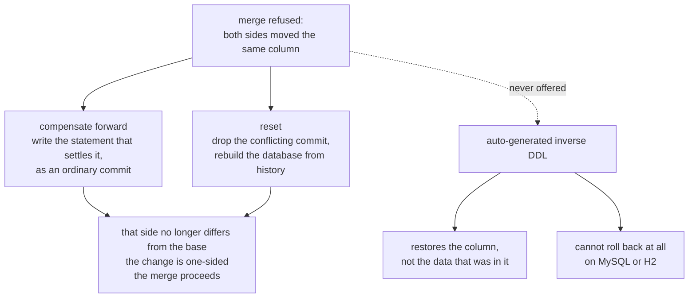
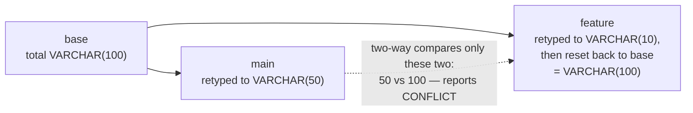
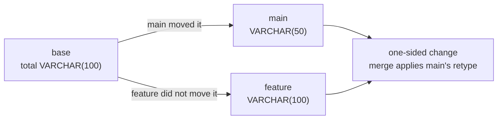
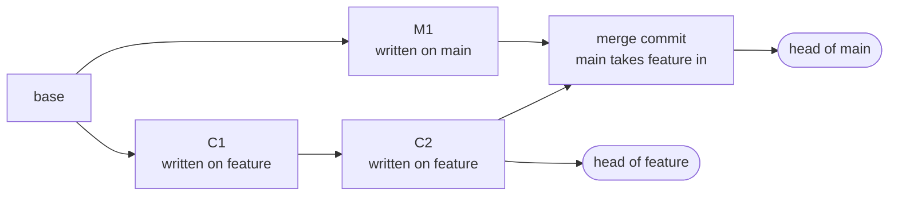

# dbgit — problem, requirements, and the decisions behind them

A working document. Every decision below is written as *context → decision → why → what was rejected
→ what it costs*, so that a decision can be argued with rather than just read. Where a decision
replaced an earlier one, the earlier one is kept and marked **superseded** — the wrong turn is
usually the most useful part of the record.

---

## 1. Problem statement

### What dbgit is

**dbgit applies git's model — branch, add, commit, diff, merge, reset — to a database schema, where
a branch is not a file but a real, running, independent database.** You point it at a database you
already have, fork branches off it that are themselves real databases, and get back the things git
gives code: a precise answer to "what changed?", a merge that understands renames and refuses only
genuine conflicts, and a history you can roll back to. Your data stays in the PostgreSQL, MySQL or
H2 you already run; dbgit versions the schema, and never becomes the database itself.

### Who it is for

The person this is built for is a **backend or platform engineer on a team that shares one
database**, and the moment it is meant to rescue is a specific one: you need to change a schema,
someone else is mid-change on the same box, and the honest options today are to wait, to coordinate
over chat, or to run your DDL and hope. Their team lead is the second user — the one who has to
answer "what actually changed between staging and this branch, and who changed it?" without reading
two folders of SQL.

Both get the same answer, and it is deliberately the one they already know: **if you can use git,
you can use this.** No new vocabulary, no new mental model, no migration-file naming convention to
learn — `checkout -b`, `add`, `commit`, `diff`, `merge`, `log`, `reset` mean here what they mean
there. The value is not that dbgit can do something no tool can; it is that the thing you already do
to code, you can now do to a schema, with a real database at the end of it rather than a file you
have to imagine applied. What that implies for the command surface — git's verbs and nothing
invented — is `decision 1`, under decision 1.

### What is in scope

Versioning the **schema** — tables, columns, constraints and indexes — and the branching, diffing
and merging that follow from it. dbgit owns the recorded history of DDL, materializes a real
database per branch from that history, and answers questions about how two branches differ. It runs
as a service several people share at once, against more than one database vendor. The full list of
DDL it accepts is in [`docs/ddl-reference.md`](docs/ddl-reference.md); the runtime shape of the
system is in [`docs/architecture.md`](docs/architecture.md).

### What is out of scope by design

**Data is not versioned** — rows are a different problem with different conflict semantics, and
deliberately left to the database (decision 1). dbgit also **never becomes your database**: it runs
alongside the PostgreSQL, MySQL or H2 you already have rather than replacing the engine, which rules
out row-level history as a side effect. It **never introspects a live database** to learn what is in
it, so out-of-band changes someone makes by hand are invisible to it by design (decision 4).
Anything it cannot faithfully model — `CHECK` constraints, conditional DDL, views, sequences,
triggers — is refused at `add` time rather than half-supported (decision 10). And it is not a
migration runner for production: `main` tracks a real database, but dbgit will not rewrite or roll
back the database it did not create (decisions 1 and 6). Known gaps within the scope above are
listed in [§4](#4-known-limitations-and-open-questions).

### What is deliberately left out — five-day scope

Effort went into the parts that make the *idea* stand or fall. The rest is understood, deferred on
purpose, and would be table stakes before this ran anywhere real.

- **Security — absent, not partial.** No authentication, authorization or transport security: the
  daemon serves whoever connects, nothing verifies the author a request claims, and the tracked
  database's password travels in the request header in clear text and sits unencrypted in
  `.dbgit/config.json`. The browser relay is unauthenticated too, guarded only by a fixed allowlist
  — a blast-radius limit, not an access control.
- **Operability.** No metrics, tracing, health endpoint, CI pipeline or packaged artifact; no
  replication or backup for the metadata store, and no migration path for its own schema; no rate
  limiting, quotas or tenancy boundaries.
- **Fault tolerance stops at the operation boundary.** Within one command every irreversible side
  effect is compensated (decision 8); across infrastructure there is nothing — one process, no
  failover, a single metadata PostgreSQL with no replica, and no retry, backoff or circuit breaking.
- **Clusters.** A branch is a database on one machine, not a topology: no replicas, sharding or
  multi-node per-branch environments, and no horizontal scaling of the daemon itself.
- **Product surface.** Constraint and index renames are not tracked as renames (§4 item 1); long
  histories replay linearly with no compaction (§4 item 4); the browser client is a demonstration
  rather than a UI; and there is no `cherry-pick`, `revert`, `tag`, `blame` or `push`/`pull`.

---

## 2. Requirements, and the two principles behind them

### 2.1 The principles

Almost every decision in [§3](#3-decisions) is one of these applied to a particular problem. Where a
decision looks surprising, one of them won an argument against something locally more reasonable.

**Correctness over convenience, latency and UX.** Stated as an ordering because it genuinely cost
all three. *Convenience*: branches are server-side only, so no offline work and no private
experimentation, and there is no undo — a conflict is settled by writing a compensating statement or
by `reset`. *Latency*: a fork replays the whole history and a diff replays both, forever linear,
because the alternative is a cache that can be wrong; `add` runs the real DDL synchronously and
holds the branch lock while it does. *UX*: a merge whose statements name a table the other branch
has since renamed is refused in the staging rehearsal even though the three-way judgment found no
conflict, because a plausible wrong schema costs far more than a refusal.

**Depth over breadth.** Five days could have gone wide — ten dialects, full DDL coverage,
`cherry-pick`, tags, remotes. They went into the four things that decide whether the idea holds up
at all: identity that survives a rename (decision 5), conflicts judged against a shared base
(decision 7), concurrency that is safe under contention (decision 8), and a replay that reproduces a
schema exactly (decision 4). The accepted-DDL set is small for the same reason, and every dropped
statement was tested against one question — **does removing this cost a capability, or only a
spelling?**

| Dropped | What it would have forced | How the intent is still expressed |
|---|---|---|
| Inline `PRIMARY KEY`/`UNIQUE`/`REFERENCES` in `CREATE TABLE` | Constraints with no name to track across branches | `ALTER TABLE … ADD CONSTRAINT <name> …` |
| `DROP INDEX` in any spelling | Whole-schema visibility in an applier that edits one table | Drop the constraint that owns the index |
| Several changes in one `ALTER TABLE` | A changeset that is no longer the unit of diff and conflict | Write them as two statements |
| `IF EXISTS` / `IF NOT EXISTS` | A statement meaning different things on different replays | The history already says whether the object is there |
| `DROP TABLE … CASCADE` | Silent drops of constraints on tables replay never sees | Drop the referencing constraint first |

Only spellings were dropped. Keeping any of them would have put a conditional, a hidden side effect
or a multi-table dependency into the replay engine — precisely the code that has to be trustworthy
for anything else to work.

### 2.2 What it must let people do

- **Work on a schema without waiting for anyone else.** A new branch is a real,
  connectable database independent of every other, and several people use one service at once. *Met
  by decisions 4 and 8.*
- **Record a change and know it actually happened.** Staging validates a statement,
  applies it to the live database, then reports; `commit` folds staged work into an immutable entry
  with author and message; `log` shows that history plus whatever is staged. *Met by decisions 4 and
  6.*
- **Answer "what changed?" precisely.** Object-level differences — table, column,
  constraint, index — with the statements that caused them, and a rename read as one object that
  moved, its indexes and constraints following. *Met by decisions 5 and 7.*
- **Combine work, and undo it.** Merge brings a branch in or refuses with the objects that
  *genuinely* conflict, meaning both sides moved them; `reset` takes a branch and its database back
  to a commit. *Met by decisions 6 and 7.*
- **Track a database that already exists**, without ever assuming the right to destroy it. *Met
  by decisions 1 and 6.*
- **Use the vendor you already run.** PostgreSQL, MySQL and H2, same commands and same model.
  *Met by decision 1.*

### 2.3 What must stay true while they do it

- **Correctness over convenience, latency and UX.** A wrong schema is worse than a refused
  command: a refusal costs one statement, a silently mismodelled statement costs every later diff.
  *Met by the whitelist (decision 10) and by refusing to synthesize an inverse (decision 6).*
- **Reproducibility.** The same history produces the same schema on any machine. *Met by
  replay-only with no introspection (decision 4), and by refusing conditional DDL (decision 10).*
- **Concurrency safety.** Two users never corrupt a branch and cannot deadlock the service.
  *Met by ordered session-scoped locks with compare-and-set behind them (decision 8).*
- **No lost work, ever.** A failure halfway leaves nothing no command can fix. *Met by
  compensating actions (decision 8), and by metadata moving before the database (decision 6).*
- **No hidden state.** Every fact about a branch lives in a store you can query. *Met by the
  metadata store (decision 1) and a daemon that holds nothing per user (decision 3).*
- **Isolation.** One slow migration does not stop everyone else. *Met by per-branch locks,
  lock-free reads and a bounded pool (decision 8).*
- **Honest reporting.** Status shown to a user is never a guess. *Met by changeset status
  written around the real execution (decision 4).*
- **Extensibility without forking the logic.** *Met by dialects modelled as data (decision 1).*
- **Testability without the world attached.** *Met by H2 branch databases and one testcontainer
  (decision 9).*

---

## 3. Decisions

Ten decisions, in the order they were made — which is also the order they were *needed*, and in one
case the order in which the first answer turned out to be wrong. Everything the project decided is
here; where a smaller choice follows from a larger one rather than setting direction of its own, it
is told as part of the decision it follows from rather than given a heading of its own.

The research behind the first is in decision 1 itself; the two principles they all serve are in
[§2](#21-the-principles).

A handful are decisions about the *command surface* rather than the schema — the calls made about
the person typing rather than the thing being typed at. They sit under whichever decision produced
them, and all follow from one promise: if you know git, you already know this.

### How this was built, in seven days

The commit history is the timeline these decisions sit on. It is a useful record precisely because
it shows the order things were understood in — the three-way conflict model, for instance, is dated
a full four days after the diff engine it replaced.

| Day | Commits | What was settled |
|---|---|---|
| Aug 17–18 | *(before the first commit)* | Reading git, Dolt, Liquibase and Flyway; identifying the gap and fixing the three commitments that follow from it — fork safely from a live database, multi-vendor from day one, multi-user from day one. PostgreSQL chosen for the metadata store (decision 1). |
| Aug 18 | `32f809d` … `5674802` | Connectors and parsers for two dialects, and the first branch fork built by *replaying history* rather than copying a database (decision 4). |
| Aug 19 | `4bc3cf7` … `83bdf48` | Client/server split with no per-user state on the daemon (decision 3); changesets, commits and a tree-shaped history (decisions 1, 4 and 6); first diff. |
| Aug 20 | `5ed8d2d` … `afb997d` | Renames stop reading as drop-plus-add — stable identity enters the model (decision 5). |
| Aug 21 | `c6aa919` … `1043be0` | Merge; the jOOQ/repository/versioning-service refactor (decision 1); constraints and indexes, and the whitelist that refuses what it cannot model (decision 10); `init` and the tracked `main` (decision 1). |
| Aug 22 | `4811ebe` … `ecb839a` | `log`/`reset` (decision 6); the whole concurrency layer — locks, ordering, bounded pool (decision 8); integration tests moved to H2 (decision 9); MySQL, via dialect-as-data (decision 1). |
| Aug 23 | `90d5e8f` … `00f7167` | **The correction**: two-way conflict detection replaced by three-way (decision 7), and compensating actions added everywhere a side effect cannot roll back (decision 8). |
| Aug 24 | `8f29c39` … `8803d6d` | `DROP TABLE`/`RENAME TO` — the first operations acting on the schema as a whole (addendum decision 10); deployment, docs, licence. |

### 1. Build for the gap: fork safely from a live database, on more than one vendor, for more than one user

*Landed: decided Aug 17–18, before the first commit; in code across `0371e17` "store forked
branches", `1043be0` "add init command", `ecb839a` "add mysql support" and `1dcb47b` "add jooq as
ORM support, extract out repositories".*

**Context.** Application code has branches, history, diffs and merges; database schemas typically have migration folders and conventions around who runs them. This creates friction: developers cannot safely work on incompatible schema changes, switching branches can leave code mismatched with the database, live diffs show what differs but not how it changed, renames look like drop + add, and merging schema changes requires manually reconciling SQL.

Existing tools sit at two extremes. Liquibase and Flyway version migration instructions but do not model database state, while Dolt versions the entire database by owning the storage engine. The gap is **schema branching on the database vendor you already use**.

**Decision.** Commit to three things:

* **Fork safely from a live database.** `main` tracks an existing database that dbgit does not own. `init` stores connection metadata but never credentials; the password stays local and gitignored. `reset` can never operate on `main`.

* **Support multiple vendors from day one.** Shared schema logic is separated from dialect-specific syntax and vendor-specific behaviour, avoiding separate implementations of the same core algorithm.

* **Support multiple users and workspaces.** Branches, commits and changesets live in a shared PostgreSQL metadata store, providing durable history, transactions and cross-process locking.

The CLI deliberately follows git's vocabulary: `checkout -b`, `add`, `commit`, `diff`, `merge`, `log`, `reset` and `branch`.

**Why.** These decisions constrain the architecture and are expensive to retrofit. Forking a real database is the core value proposition; multi-vendor support prevents the design from becoming tied to one database; and shared metadata is required for team collaboration and history that survives branch deletion.

PostgreSQL is used only for dbgit's metadata, regardless of the user's database vendor. Its ACID transactions and advisory locks provide the required concurrency model without another dependency. Git's vocabulary is intentional: users should be able to transfer their existing mental model directly to schema versioning.

**Rejected.** *Git as the history store* — introduces filesystem-style working copies and unsuitable merge semantics. *Branch databases as the history store* — history disappears when a branch is deleted. *SQLite* — no shared server or cross-process advisory locks.

**Cost.** The metadata store is PostgreSQL-only, even when branch databases use MySQL or H2. The initial CLI also omits `push`, `pull`, `cherry-pick`, `revert`, stash and soft/hard reset. Before `init`, `main` has no associated database and reports that explicitly rather than silently falling back to a scratch database.

---

### 2. Branches are compared by replayed state, not by their lists of changesets

*Landed: Aug 19–20 — `83bdf48` "dbgit diff - initial version", reworked by `35a7bc9` "refactor dbgit
diff". The question that had to be answered before `diff` could mean anything.*

**Context.** Every branch carries a list of changesets, so there are two candidate answers to "what
differs between `a` and `b`". The cheap one compares those lists and reports the statements one ran
that the other did not. The expensive one replays both histories into schemas and compares the
schemas.

**Decision.** Both, for two different questions, and never confused. *Which commits are exclusive*
is a set difference over commit ids, and that is what tells a merge which statements to replay.
*What actually differs* comes from replaying both histories into `TableModel`s and diffing those.
Statement lists decide **provenance**; replayed state decides **difference**.

**Why.** A changeset list records what was typed, not what is true. A branch that adds a column and
later drops it has run two statements and changed nothing; a branch that never touched the table has
run none. Compare the lists and those two branches differ — which is false, and since a difference
that is not real would be refused as a conflict, it would make some pairs of branches permanently
unmergeable. The converse fails too: identical statement text on both sides can mean different
things when what came before differs, so matching statements is not evidence of matching schemas
either. The only thing that can answer whether two schemas differ is two schemas. But state alone is
equally insufficient, which is why both survive: without the commit-id set difference a merge cannot
tell *which* statements to replay, and cannot attribute a difference to one side — the entire basis
of conflict judgment in decision 7.

**Rejected.** *Changeset-list comparison alone* — cheap, and wrong in exactly the case a versioning
tool exists to handle. *State comparison alone* — no way to know what a merge should replay, and no
way to attribute a change to a side.

**Cost.** Every `diff` replays both histories in full, and every fork replays one, so both are
linear in history length. Accepted knowingly: the alternative is a cached schema that can be wrong,
and a schema tool whose answer might be stale has no reason to exist. Compaction is the known answer
if it ever starts to hurt (§4 item 4).

---

### 3. Every branch lives on the server; there are no local branches, and no push or pull

*Landed: Aug 19 — settled with the client/server split in `4bc3cf7`; a scoping decision rather than a feature.*

**Context.** Git branches are local until pushed. Since dbgit borrows git's vocabulary, the question was whether it should also support private local branches and later publishing.

**Decision.** No. A branch is created directly in the shared metadata store and is immediately visible to everyone. There are no local branches, remotes, `push`, `pull`, `fetch` or `clone`. The daemon is stateless: it holds no per-user branch or working-directory state. Each request carries the caller, branch and database credentials, while the client only stores its checked-out branch and how to reach `main`.

The command surface follows the same model: `add` reads DDL from stdin, commit messages use the remainder of the command line, and each command owns its help definition so the CLI and help cannot drift.

**Why.** A dbgit branch is a running database on a shared server, not a collection of local files, so there is nothing meaningful to keep locally. This also eliminates divergent local branches, stale state, fetch/merge distinctions and session state on the daemon. Two workspaces can use the same daemon while independently operating on different branches.

The request header is mandatory because a missing branch or caller cannot safely default to anything. `add` uses stdin because DDL is naturally multi-line, while commit messages use the remainder of the line because shell quoting has already been removed before the daemon receives the command.

**Rejected.** *Local branches with push/pull* — introduces distributed-version-control machinery for server-side databases without a clear benefit. *Separate help files* — can drift from the actual command implementation. *Annotations plus reflection* — adds machinery without enough value for the small command surface.

**Cost.** There is no offline work or private experimentation; every branch is immediately visible to the team. Help text also lives in Java source, which is acceptable for a developer-oriented tool.

---

### 4. The recorded history is the source of truth; a live database is never introspected

*Landed: Aug 18 — `7dd4e8a` "add branch-fork", `5674802` "branch-fork flow tested". The first fork replayed history rather than copying a database, and every later feature inherited it.*

**Context.** A schema-versioning tool can learn a schema by introspecting the database or by replaying recorded DDL. Since `add` already replays history to validate and compute changes, the question was whether it should also execute the DDL against the live database.

**Decision.** The recorded history is the source of truth, but every statement is also executed against the real database. `DdlParser` and `Replayer` build the in-memory schema model by replaying DDL; `Stager` validates the change, records it as `PENDING`, executes it, then marks it `APPLIED`. A fork creates an empty database and replays the committed history in order.

Because metadata and the branch database cannot share a transaction, changesets move through `PENDING → APPLIED → COMMIT`, with the `PENDING` record written before executing the DDL.

**Why.** Replay makes fork, merge and reset deterministic: all are effectively "replay this history into an empty database." It also keeps schema semantics vendor-independent.

The real database is still required because the model cannot represent every database rule. Executing DDL catches real type-system, constraint, collation and database-specific errors immediately. It also makes the live branch database usable by applications and continuously validates that the recorded history matches what the database actually accepts.

Writing `PENDING` first ensures an in-flight operation is visible rather than leaving an executed statement with no record.

**Rejected.** *Introspect-and-diff* — loses intent and cannot distinguish renames from drop + add. *Model only, execute at commit* — leaves the branch database stale and moves failures to commit time. *Database only* — requires live introspection and loses semantic history. *Async database updates* — creates two eventually-consistent sources of truth. For forks, *database cloning or dumps* — copies existing drift and is not portable across vendors.

**Cost.** Out-of-band changes to branch databases are invisible and eventually surface as replay failures. `add` waits for the real DDL to complete, and fork time grows with history length. A failed `PENDING` operation must be cleaned up rather than left as a valid changeset.

---

### 5. Every schema object carries a stable identity that survives a rename

*Landed: Aug 20 — `6609da5` "detect rename conflict; squashes the drop and readd". The commit that stopped a rename reading as a drop plus an add.*

**Context.** Comparing schemas by name makes `RENAME COLUMN` look like one column disappearing and another appearing. That loses the fact that it is the same object and can lead to dropping data.

**Decision.** Every table and column gets a stable identity that survives renames. A column rename keeps its `StableId` and changes only its name; a table rename does the same. Constraints and indexes reference column identities rather than names, so they automatically survive column renames.

For example:

```text
Before:
users
  id        → StableId C1
  full_name → StableId C2
  index     → references C2

RENAME COLUMN full_name TO name

After:
users
  id   → StableId C1
  name → StableId C2
  index → still references C2
  
So the diff is:

C2: full_name → name

rather than:

DROP full_name
ADD name
DROP index
ADD index
```
DatabaseDiff similarly matches tables by identity rather than name. Identity comparison also normalizes identifiers and type names (lowercase identifiers, UPPERCASE types) while leaving defaults unchanged, since default values can contain case-sensitive data.
One deliberate exception: a table's differsFrom compares only its name, not its contents. 

**Why.** Stable identity is what allows dbgit to distinguish a rename from a drop + add and detect conflicts on the same schema object.

```text
For example:

main:
  user.email → C2

branch A:
  RENAME email TO contact_email   → C2

branch B:
  ALTER email TYPE VARCHAR(500)   → C2

Both branches modify the same object C2, so merge can detect a genuine conflict:

C2:
  rename: email → contact_email
  retype: VARCHAR(255) → VARCHAR(500)
  
```
Without stable identity, the merge would see email disappearing on one side and contact_email appearing, while the other side modifies email — making the relationship between the changes impossible to determine reliably.
The narrower table comparison prevents independent changes to the same table from becoming false table-level conflicts. Member-level changes are already captured by TableDiff.

**Rejected.** Name matching — treats renames as drop + add and can destroy data. Table content comparison for differsFrom — turns harmless parallel changes to the same table into conflicts.

**Cost.** Constraints and indexes themselves do not have stable identities, so renaming one still appears as drop + add. Extending stable identity to them is possible but was left for later.

---

### 6. A merge commit is only its two pointers — and a conflict is resolved by compensating forward or by `reset`

*Landed: Aug 21 — `c6aa919` "merge command initial version"; settled Aug 23 by `4cd06e9` "merge
fixes for conflict resolution and compensating transactions", after interactive resolution was
designed and abandoned.*

**Context.** These look like two questions and are one. What a merge commit is allowed to *contain*
seems unrelated to how a user gets out of a refused merge — until you try the obvious answer to the
second. An interactive resolver that asks which side wins has to write the answer down, and the only
place to write it is the merge commit. So deciding what the commit holds decides what resolutions
can exist.

**Decision.** The commit holds nothing but pointers. What a merge brought in stays attributed to the
commits that originally introduced it, reachable by walking the second parent. A commit records
`parent_commit_id` and, for a merge, `second_parent_commit_id`; a branch records only its
`head_commit_id`, and a fork copies its parent's head. `commits(branch)` walks that ancestry — first
parent's full history, then whatever is reachable only through a second parent, then the commit
itself, each emitted once at its original position. Each commit also stores the branch it was
created on, as plain text with no foreign key, printed by `dbgit log` as the `Branch:` line.

A conflict therefore has exactly two resolutions, both performed by the user and both ordinary
history: **compensate forward**, writing the statement that settles the disagreement — which then
merges cleanly, because the compensating side no longer differs from the base — or **`reset`** to a
commit before the conflicting change. dbgit never synthesizes an inverse statement.



Both resolutions need machinery. A merge is **rehearsed** first: fork a staging branch from the
target's committed history, replay the incoming changesets there, and only once that succeeds apply
the same DDL to the target and record the merge commit. The staging branch is named per attempt
(`merge/<a>-<b>-<nonce>`) and dropped in a `finally`. And `reset` is a rebuild, ordered for its
failure mode: `Resetter` replays the truncated history first so an incoherent history fails before
anything is destroyed, then moves HEAD and deletes the working set in one metadata transaction, then
drops and rebuilds the database last.

**Why.** Duplicating changesets under a merge commit would put the same statement twice in one
branch's history, and a replay would run it twice. A shared graph makes a fork free — it is a copied
pointer — and lets a merge bring in work from a branch that has since been deleted; the `Branch:`
line is then the only thing distinguishing a branch's own work from what it inherited, and it
carries no foreign key because a finished branch is deleted while its commits must stay.

Auto-rollback is absent for three reasons, the first of which settles it alone.

**DDL has no reliable inverse**: the inverse of `DROP COLUMN total` looks like `ADD COLUMN total NUMERIC(10,2)`
and is not, since that restores the column and not one row of the data — and narrowing a type
truncates every longer value, so retyping back restores the declaration while the characters stay
gone. An undo that silently restores structure over destroyed data is worse than no undo, because
the schema then claims a state the data does not support and every later diff agrees with the claim.

**Transactional DDL is not portable**, and multi-vendor was a day-one commitment: PostgreSQL rolls a
failed replay back cleanly, MySQL forces an implicit commit and leaves it half-applied, and H2 does
the same — so the promise would be true on one of three supported vendors. 

**And the rebuild  primitive already exists**: because the recorded history is the source of truth, "go back" means
truncate the history and replay it, which behaves identically everywhere. The rehearsal exists
because the replay into the target cannot be rolled back on every engine, so it must not be the
first place the incoming statements are tried; the nonce is not decoration, since the name was once
derived from the two branch names alone and two overlapping merges of the same pair collided on a
branch that already existed. `reset` does the database last because that step cannot be
transactional, so a failure leaves the metadata already describing the target commit — meaning
re-running the same reset finishes the job.

**Rejected.** *Generated inverse DDL*, Liquibase's `rollback` — correct for the easy half of
statements, silently wrong for the half that loses data, and undefined where the vendor cannot roll
back. *Interactive conflict resolution writing resolved changesets into the merge commit* — it makes
the merge commit a place where statements exist that no branch ever ran, so replaying a branch's
history no longer reproduces that branch, and it puts a stateful prompt in the middle of a protocol
whose whole design is one request, one response, no session. *A scalar `next_commit_id`* on the
commit table, which the schema used to carry — it could never be right, since a commit can have
several children (that *is* branching) and two branches sharing a HEAD both wrote it while holding
locks on *different* branches, a data race with no correct outcome. Nothing read it; children are
derivable from the parent pointers.

**Cost.** Resolving a conflict is manual — a person writes a statement or picks a commit to reset
to, and there is no one-key escape. `reset` is heavy, dropping and rebuilding a database rather than
stepping back one statement, and every merge builds and drops a staging database. Accepted, because
both resolutions leave a history that still replays to exactly what the database contains, which is
the property the entire tool exists to keep. Commits after a reset target stay in the shared graph,
merely unreachable from this branch, since other branches may still share them.

---

### 7. Two-way comparison was wrong twice over; three-way against a shared base replaced it

*Landed: Aug 23 — `45193b6` "fix reset and conflict resolution by introducing a 3-way merge",
superseding the two-way detector from `83bdf48` (Aug 19). The one decision here that was made
twice.*

**Superseded.** The original diff compared the two branches' schemas directly and called anything
that differed a conflict; divergence was found by walking both flattened histories and taking the
common prefix. Both halves were wrong, independently.

**Context — the invented conflict.** Two schemas cannot say who *moved*. `varchar(100)` on one side
and `varchar(10)` on the other is a disagreement only if both branches changed it; otherwise it is a
change one of them has not received yet. Start from a shared `orders(id INT, total VARCHAR(100))`:

```
main     ALTER TABLE orders ALTER COLUMN total TYPE VARCHAR(50);    -- committed
feature  ALTER TABLE orders ALTER COLUMN total TYPE VARCHAR(10);    -- committed
```

Both moved it, so the merge is refused — correctly. The user then resolves it exactly as the tool
advises, `reset`ting `feature` back to before its own retype, leaving `feature` at `VARCHAR(100)`,
precisely the shared base, while `main` sits at `VARCHAR(50)`. Two-way still sees `100` against
`50`, still calls it a conflict, still refuses. **The resolution the tool recommended could not
clear the conflict the tool reported**, and no statement would escape it, because the detector was
answering "do these differ?" when the question is "did both sides move it?".





**Context — the duplicated replay.** Once either branch has been the target of a merge, a shared
commit sits at *different indexes* in the two flattened histories. Say `feature` commits `C1` and
`C2`, `main` commits `M1`, and `feature` is merged into `main`; later `main` is merged back into
`feature`, ordinary enough once `main` has moved on. Flattened, the two read:

```
feature   C1  C2
main      M1  C1  C2  (merge)
```



A prefix walk diverges at the very first pair — `C1` against `M1` — and therefore calls everything
in `main` exclusive to it, including `C1` and `C2`, which `feature` itself wrote. Replaying those a
second time dies on the first statement that is not idempotent: `ERROR: column "total" already
exists`.

**Decision.** Stop comparing the two sides to each other. `Differ` replays a **third** schema —
`sharedChangesets`, the commits in both ancestries — and `SideChanges.since(base, tables)` records,
per `StableId`, which side actually changed each differing object. `Side.BOTH` means only "both
sides have it and describe it differently" and is deliberately *not* a conflict on its own;
`HistoryDiff.isConflicting(id)` means both sides moved it since the base. Divergence becomes a set
difference by commit id, never a positional prefix. And `Differ` is the single entry point for both
`diff` and `merge`: `Merger` reads `rightOnly()` for what to replay and `isConflicting(id)` for what
to refuse, while `HistoryDiffFormatter` only renders.

**Why.** Against the base, the invented conflict answers itself — `feature` matches the base, so
only `main` moved, so the change is one-sided and applies cleanly. A set difference has no notion of
index, so `C1` and `C2` appear in both sets and drop out, leaving `M1`, which is exactly what
`feature` lacks. One entry point matters because a merge that decided what diverged its own way
could contradict the diff a user ran a moment earlier, which is the kind of inconsistency that
destroys trust in a tool like this. It also means a side reports its statements only where it
actually left the object somewhere new — a branch that retyped a column and then retyped it back has
run statements and changed nothing.

**Rejected.** *Two-way comparison*, above, on the evidence of both failures. *Positional prefix
matching* for divergence, for the same reason: it encodes an assumption — that shared history is a
shared prefix — which stops being true the first time anyone merges.

**Cost.** A third history is replayed on every diff and every merge, on top of the two being
compared. This is the single largest correction in the project, and it arrived four days after the
diff engine it replaced; the bug it fixes is what `scripts/live-demo-eof.sh` was written around and
still guards.

---

### 8. Branch mutations are serialized by a session-scoped PostgreSQL advisory lock

*Landed: Aug 22 — `dfb774f` "add concurrency; initial version", `d0ce041` "concurrency support,
changes and fixes"; compensation added Aug 23 in `4cd06e9`.*

**Context.** The daemon serves many people at once, and a mutating command is not a transaction.
`Stager`, `Committer`, `Merger` and `Resetter` all interleave metadata transactions with side
effects that cannot be rolled back — live DDL, `CREATE`/`DROP DATABASE`, `docker`. Whatever
serializes them has to outlast any one transaction, survive across daemon processes, and cope with a
handler dying midway.

**Decision.** `AdvisoryBranchLock` takes `pg_try_advisory_lock` on a connection of its own and holds
it for the whole operation, polling until it gets it — **session**-scoped, not transaction-scoped,
and living in the core operation classes rather than in `MetadataVersioningService`. Around that,
five things belong to the same decision. `BranchLocks.acquire` sorts branches lexicographically and
releases in reverse. Reads — `log`, `diff`, `branch` — take no lock at all. Two backstops sit behind
the lock: `BranchMetadataRepository.updateHeadCommitId` is a compare-and-set, and reads that inform
a decision go through `MetadataDatabase.snapshot`, a `REPEATABLE READ` transaction. Every
irreversible side effect has a compensating action. And `DbGitCommandListener` hands each socket to
a `ThreadPoolExecutor` sized by `concurrency.handlerThreads`, answering `ERR Server busy` on
overflow and draining rather than killing on close. Connections are not pooled.

**Why.** A `pg_advisory_xact_lock` would already have been released by the time the real DDL runs,
which is precisely the window that matters. Advisory and on the metadata store, because it then
holds across daemon processes rather than within one JVM and needs no new dependency — that
PostgreSQL is already mandatory and always-on — and because closing the connection drops the lock,
so a handler that dies without unlocking still frees the branch. `try` in a poll loop rather than a
blocking `pg_advisory_lock`, because that yields a timeout and therefore a reportable error instead
of an indefinite hang. Lexicographic ordering because `merge` holds target and source while
`checkout -b` holds parent and child: two merges in opposite directions, each taking "my branch
first, then yours", is the textbook deadlock — and with a try-lock poll loop it is worse than a
clean deadlock, since the two spin against each other until both time out and both fail. Reads take
nothing because a migration can hold a branch for a long time and nobody should be unable to *look*
at one; the read-modify-write reads are already inside the lock, so what goes unlocked is only
output for a human, stale the moment it reaches the terminal. The backstops exist because a lock
that is ever missed should produce a visible error rather than a commit that silently becomes
unreachable, and because outside a transaction jOOQ takes a fresh connection per query — so
reconstructing a branch's commits spanned three snapshots and could observe a commit landing halfway
through. Compensation exists because transactions cannot span a metadata store and a live `CREATE
DATABASE`, so the only alternative is a state no command can fix: a fork that fails after claiming
its name drops the half-built database and returns the name, a changeset the database rejected is
deleted rather than left at `PENDING` where it could never be committed yet would still count as
working set, a merge's staging branch is dropped in a `finally`, and `ProcessCommandRunner` bounds
`docker` with a timeout because a hung subprocess costs a handler thread permanently. The pool is
bounded because unbounded queueing turns overload into a long tail of timeouts instead of an
immediate, honest refusal; it drains on close because a `reset` caught between its `DROP DATABASE`
and its replay must finish; and `ensureBranchDatabasesRunning()` is called *outside* the locks,
since it is global and a cold image pull would otherwise stall every command on those branches for
minutes.

**Rejected.** *A transaction-scoped advisory lock* — released before the DDL it is meant to protect.
*A blocking `pg_advisory_lock`* — no timeout, so contention becomes an indefinite hang with nothing
to report. *A JVM-level lock* — correct only within one process; `InMemoryBranchLock` exists solely
as a test double for exactly that reason. *Unbounded queueing* — trades an honest refusal for a slow
one. *Connection pooling* — it would buy latency rather than capacity, and introduces a real hazard,
since a pooled idle connection to a branch database blocks the `DROP DATABASE` that fork-failure
cleanup and `reset` both depend on.

**Cost.** Each in-flight mutating command pins one metadata connection for the lock on top of the
one doing the work, so the metadata server needs room for roughly `2 × handlerThreads` —
PostgreSQL's default of 100 leaves ample headroom. Ordered acquisition buys deadlock-freedom, not
parallelism: both commands need both branches, so there is nothing to overlap. And the pool must be
sized for the *slowest* command rather than the average.

---

### 9. Integration tests: H2 branch databases, one PostgreSQL testcontainer for metadata, skip without Docker

*Landed: Aug 22 — `6088a24` "add integration tests", then `06fea71` "make integration tests h2
based".*

**Context.** The thing worth testing is a whole installation: a daemon, a socket, a metadata store,
a branch database per branch, and real locks between them. Testing that honestly means standing it
all up per test; standing it all up *literally* means a database container per branch, which costs
minutes per test and makes the suite something nobody runs.

**Decision.** Assemble the whole installation per test — daemon on its own port, client with its own
`.dbgit`, a real socket between them, the real `MetadataVersioningService` over real jOOQ, real
advisory locks — and substitute only infrastructure. Branch databases are in-memory H2. The metadata
store is a PostgreSQL testcontainer on the **fixed** port the test `dbgit.json` names, 54329. Each
test truncates with `RESTART IDENTITY`. Without Docker the suite skips rather than fails.

**Why.** H2 is legitimate here rather than a second implementation: `H2Connections` and
`H2Connector` are the same production classes `dialect: "h2"` selects for real, and `H2Databases`
only tracks what was handed out so `reset()` can empty it between tests. The metadata store *cannot*
be H2 at all — jOOQ is pinned to the Postgres dialect, the schema is Postgres DDL down to
`BIGSERIAL`, and the branch lock is a Postgres advisory lock. Its port is fixed rather than
ephemeral because `MetadataStoreConfig` is a static singleton read long before any container could
start, so the container has to follow the configuration rather than the reverse; 54329 is chosen so
it cannot collide with a developer's own server on 5432. `RESTART IDENTITY` is what lets a test
assert on `commit #1`. Skipping without Docker keeps `mvn test` clean on a machine that has none.
And the reason this layer earns its keep over the unit tests next door is `DatabaseSchema`, which
reads `INFORMATION_SCHEMA` back out: since dbgit never introspects (decision 4), that readback is
the only way to show a fork, merge or reset actually put the schema it claimed into the database it
built.

**Rejected.** *A real database container per branch* — minutes per test, so the suite stops being
run. *Mocking the metadata store or the socket* — it would test the mock, and the interactions worth
catching are precisely the ones at those seams. *An ephemeral container port* — impossible given a
static config singleton read at class-load time. *Failing rather than skipping without Docker* — it
makes the default `mvn test` red on a clean machine for a reason unrelated to the code.

**Cost.** One real divergence: H2 commits DDL implicitly, so a replay that fails part-way is not
rolled back there as it would be on PostgreSQL — that behaviour is asserted at the unit level
instead. And a fixed port is a fixed port: something else already listening on 54329 breaks the
suite.

---

### 10. dbgit is not a SQL parser: JSqlParser does the parsing, and the accepted DDL is a strict whitelist

*Landed: Aug 18 — `d22c406` "add postgres and h2 connectors and parsers", the first commit that had
to read DDL at all; the whitelist settled Aug 21 in `476bca2` and was extended Aug 24 by `8f29c39`.*

**Context.** dbgit has to understand DDL text well enough to build a `TableModel` from it. Writing a
SQL parser is a multi-month project in its own right, and one where a half-finished job is
indistinguishable from a finished one until it corrupts something. Whatever the parser understands
then decides what the model can represent — and therefore what has to be refused.

**Decision.** Delegate the parse, and refuse the remainder explicitly. **JSqlParser** (5.3) does all
tokenizing and produces the AST; `SqlDdlParser` is a translation layer over it, dispatching to
`ColumnMapper`, `ColumnSpecs` or `ConstraintMapper` and producing a `SchemaOperation`. Nothing in
this codebase tokenizes SQL. On top of that sits a whitelist of ten operations — `CREATE TABLE`
(columns only), `DROP TABLE`, `ALTER TABLE … RENAME TO`, `ALTER TABLE … ADD|DROP|RENAME COLUMN`, the
dialect's retype, `ADD CONSTRAINT … PRIMARY KEY|UNIQUE|FOREIGN KEY`, `DROP CONSTRAINT`, and `CREATE
[UNIQUE] INDEX` — with `NOT NULL`, `DEFAULT` and the dialect's identity spec exempt from the
constraint rules, being properties of the column that `ColumnModel` already carries. Every refusal
that has a supported equivalent quotes it, filled in with the user's own identifiers.

**Superseded.** A constraint written inline (`id INT PRIMARY KEY`, `email TEXT UNIQUE`) or as a
table-level clause used to be **silently ignored** — so the constraint existed in the real database
and not in the model, invisible to `dbgit diff` and absent when the branch was forked and its
history replayed. The `IF EXISTS` family was inconsistent in the same spirit: `CREATE TABLE IF NOT
EXISTS` was accepted and honoured while `ALTER TABLE IF EXISTS …` was accepted with the clause
silently discarded, found only while adding `DROP TABLE`/`RENAME TO` and asking what `IF EXISTS` on
*those* should mean.

**Why.** The value of this project is the model, the stable identities and the merge semantics, none
of which improve by owning a grammar; delegating also means adding a statement is usually one branch
in the translation plus one `SchemaOperation` variant. The refusals are structural rather than
preference. `CHECK` has nowhere to live in `ConstraintType`. `DROP INDEX` is refused in every
spelling because an index name carries no table and dbgit replays a history one table at a time, so
it cannot tell which table's model to edit. `IF EXISTS`/`IF NOT EXISTS` is refused everywhere
because it would mean one thing on a branch that has the object and nothing on one that does not,
and every statement in a replayed history must mean the same thing every time it runs. `DROP TABLE …
CASCADE` can drop constraints on other tables that replay never sees and `dbgit diff` can never
report. Several changes in one `ALTER TABLE` are refused because one statement, one change is the
unit a changeset, a diff and a conflict are all expressed in. MySQL's own `RENAME TABLE t TO u` is
refused because `ALTER TABLE t RENAME TO u` is accepted by every dialect, so only one form needed
accepting. And a refusal names the fix because strictness is only defensible if it is cheap to
comply with — the rejection is where a user meets the model's boundary, so it is the one place worth
spending words on what was wrong, why the tool cares, and what to type.

`DROP TABLE` and `RENAME TO` needed one addition worth recording. Every other operation is one table
in, one table out: `SchemaOperationApplier.apply` edits the `TableModel` it is handed, with no view
of the schema as a whole. These two are the first whose effect is on the schema **map** — a drop
leaves no table behind, a rename moves to a different key — so the applier keeps its shape (a drop
yields `null`, a rename the same table under a new name) and the map-level bookkeeping moved up into
`Replayer.apply(Map, String)`, the only place that already owns the whole map while replaying.

**Rejected.** *Hand-rolled parsing* — weeks of effort to be permanently slightly wrong. *Asking the
target database to parse it*, via `PREPARE` or execute-and-roll-back — needs a live connection at
`add` time, differs per vendor, cannot roll back on MySQL, and yields a yes/no rather than the AST
the model is built from. *Silently ignoring the unmodellable part* — the original behaviour, and
precisely the bug this decision exists to kill. *A generic parse error naming the offending token* —
accurate and useless. *Passing the whole schema map into `SchemaOperationApplier`* — it would make
the applier the schema's owner and contradict its contract of editing one table it is given.

**Cost.** dbgit is bounded by what JSqlParser understands and by the shape of its AST; a few
refusals exist because the AST does not distinguish something the model needs, and upgrading the
library is a real dependency risk on the one component nothing else can replace. The refusal
messages carry real content and would drift if the rules changed, so `constraints-rejected-demo.sh`,
`table-commands-rejected-demo.sh` and `RejectedDdlIntegrationTest` all assert on them.

---