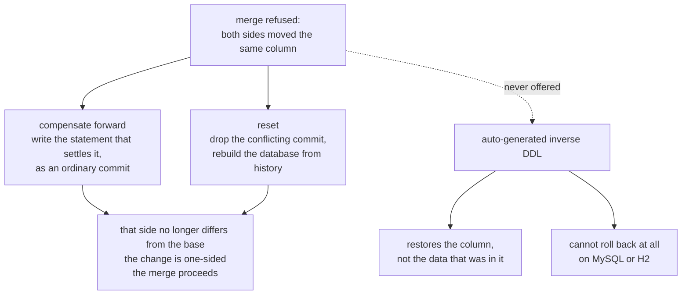
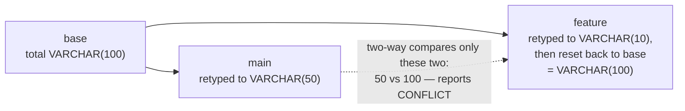
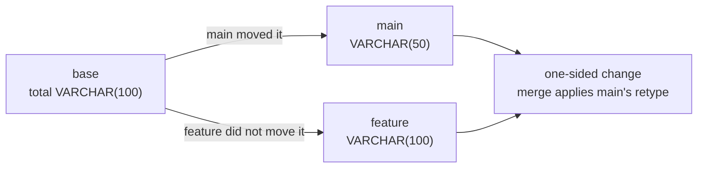

# dbgit — problem, requirements, and the decisions behind them

A working document. Every decision below is written as *context → decision → why → what was rejected
→ what it costs*, so that a decision can be argued with rather than just read. Where a decision
replaced an earlier one, the earlier one is kept and marked **superseded** — the wrong turn is
usually the most useful part of the record.

---

## 1. Problem statement

### What dbgit is

**dbgit applies git's model — branch, add, commit, diff, merge, reset — to a database schema, where
a branch is not a file but a real, running, independent database.** You point it at a database you
already have, fork branches off it that are themselves real databases, and get back the things git
gives code: a precise answer to "what changed?", a merge that understands renames and refuses only
genuine conflicts, and a history you can roll back to. Your data stays in the PostgreSQL, MySQL or
H2 you already run; dbgit versions the schema, and never becomes the database itself.

### The problem it solves

Application code has branches, history, diffs and merges. A database schema, in most teams, has a
folder of migration scripts and a social convention about who is allowed to run them. The two do not
line up, and every mismatch is paid for by a person:

- **There is one database and many developers.** Two people cannot try incompatible schema changes
  at the same time. Someone waits, or someone's change is quietly reverted on the shared box.
- **A branch of code has no matching branch of schema.** Checking out a colleague's feature branch
  gives you their code against your schema. Whether that runs is a coin toss.
- **Nobody can answer "what changed?" precisely.** Diffing two live databases tells you they differ.
  It cannot tell you *who* changed a column, or whether the difference is a disagreement or just one
  side not having caught up.
- **Renames are invisible.** Every tool that compares two schemas by name sees a rename as a column
  dropped and an unrelated column added — which is also how it will "helpfully" apply it.
- **Merging schema changes is manual.** Two branches that both altered the same table are reconciled
  by a human reading two folders of SQL.

### Why build it at all — the gap

Two days went into reading how the existing tools work before any code was written: git's own object
model, Dolt, Liquibase and Flyway. The conclusion was that the space has two halves and nothing sits
in the middle.

**Liquibase and Flyway version the *instructions*.** An ordered list of scripts, a table recording
which ones ran, and a convention about who runs them. They never model what is inside the database,
so they cannot tell you what two branches' schemas differ by, cannot merge, and cannot answer "is
this column a rename or a new column?" — because they have no representation in which that question
exists.

**Dolt versions the *data*, by being the database.** It is a genuinely excellent piece of
engineering and the closest thing to git-for-databases that exists — but the price of admission is
migrating onto Dolt's own storage engine. A team already running PostgreSQL with data they cannot
move is not a customer, and schema branching is not worth an engine migration.

**The gap is a real, forked database per branch, on the vendor you already run.** That is the one
thing neither half offers, and it is what the whole design is pointed at. Three commitments followed
from it and were fixed before the first commit:

- **Fork safely from a live database.** `main` tracks something real that dbgit did not create and
  must never damage; every other branch is a fork it fully owns (decision 1). This is the
  differentiator, and also the sharpest constraint — it is why `reset` refuses `main` (decision 6)
  and why nothing is ever written to the tracked database that was not asked for.
- **Enough vendors to prove the seam, from day one.** Three — PostgreSQL, MySQL, H2 — not because
  breadth is the goal, but because one vendor lets you pretend a seam exists without ever testing
  it. Committing to three on day one is what forced dialect differences to be modelled as data
  rather than accumulated as special cases (decision 1), and it is why each parser is strict to its
  own dialect (decision 10). Retrofitting a second vendor into a Postgres-shaped design is the kind
  of change that never quite finishes; a fourth vendor now is a `DialectGrammar` and two small
  classes.
- **Multi-user concurrency as a requirement, not a phase two.** A tool whose entire premise is "stop
  waiting for the shared box" fails its own pitch if two people cannot use it at once (decision 8).

**The metadata store is PostgreSQL, chosen on the same day and for unglamorous reasons:** it is
open-source, it is ACID, its transactional guarantees are strong enough to hold the commit graph
honestly, and it has session-scoped advisory locks — which turned out to be the exact primitive the
concurrency model needed four days later (decisions 1 and 8).

### Two principles that decided the rest

Almost every decision in [§3](#3-decisions) is one of these two applied to a particular problem.
Where a decision looks surprising, it is usually because one of these won an argument against
something that seemed more reasonable locally.

#### Correctness over everything — convenience, latency, and UX

Not "correctness matters"; everyone says that. This one is stated as an ordering, and the ordering
only means something where it *cost* one of the other three. It did, three times over:

- **Over convenience.** Branches are server-side only, so there is no offline work and no private
  experimentation (decision 3). Anything dbgit cannot faithfully model is refused at `add` time
  rather than accepted and half-tracked (decision 10). There is no undo: a conflict is settled by
  writing a compensating statement or by `reset`, because a generated inverse would be a lie on any
  statement that lost data (decision 6).
- **Over latency.** A fork replays the entire history rather than copying a database or restoring a
  snapshot, and a diff replays *both* histories in full rather than caching a schema (decision 4,
  decision 4, decision 2). Fork and diff are therefore linear in history length, forever, by choice
  — the alternative is a cache that can be wrong, and a schema tool whose answer can be stale has no
  reason to exist. `add` runs the real DDL synchronously and holds the branch lock for as long as
  the database takes (decisions 4 and 8), so a `CREATE INDEX` over millions of rows blocks that
  branch. That is the honest cost of knowing the statement actually applied.
- **Over UX.** The tool fails loudly in a case where its own model says it should succeed: a merge
  whose statements name a table the other branch has since renamed is refused in the staging
  rehearsal rather than guessed at, even though the three-way judgment found no conflict (§4 item
  2). The friendlier behaviour — rewriting the statement to what it "obviously" meant — risks
  silently binding to a different column that happens to share a name, and a plausible wrong schema
  is far more expensive than a refusal.

The storage layer is the same principle: the metadata store is ACID, and a **session**-scoped
advisory lock is held across the several transactions one command spans, because a
transaction-scoped lock would already have been released when the real DDL ran (decisions 1 and 8).
Compare-and-set on HEAD backs it up, so a missed lock surfaces as a visible error rather than a
silently unreachable commit (decision 8).

#### Depth over breadth — a tight core beats a wide surface

The five days could have gone wide: ten dialects, full DDL coverage, `cherry-pick`, `revert`, tags,
remotes. They went narrow and deep instead, into the four things that decide whether the *idea*
holds up at all — identity that survives a rename (decision 5), conflicts judged against a shared
base (decision 7), concurrency that is actually safe under contention (decision 8), and a replay
that reproduces a schema exactly (decision 4). Get those wrong and no amount of surface area
matters; get them right and the surface is ordinary work.

The accepted-DDL set is deliberately small for the same reason, and the test applied to every
dropped statement was: **does removing this cost a capability, or only a spelling?** Only spellings
were dropped.

| Dropped | What it would have forced | How the intent is still expressed |
|---|---|---|
| Inline `PRIMARY KEY`/`UNIQUE`/`REFERENCES` in `CREATE TABLE` | Constraints with no name for the model to track across branches | `ALTER TABLE … ADD CONSTRAINT <name> …` — named, diffable, mergeable |
| `DROP INDEX` in any spelling | Whole-schema visibility in an applier that deliberately edits one table at a time | Drop the constraint that owns the index |
| Several changes in one `ALTER TABLE` | A changeset that is no longer the unit of diff and conflict | Write them as two statements |
| `IF EXISTS` / `IF NOT EXISTS` | A statement meaning different things on different replays — fatal to reproducibility | The history already says whether the object is there |
| `DROP TABLE … CASCADE` | Silent drops of constraints on other tables that replay never sees | Drop the referencing constraint first |

Every row costs the user a keystroke or two and costs the design nothing; each one that had been
kept would have put a conditional, a hidden side effect, or a multi-table dependency into the middle
of the replay engine — which is precisely the code that has to be trustworthy for anything else to
work. That is the whole trade: [`docs/ddl-reference.md`](docs/ddl-reference.md) is short *so that*
`Replayer`, `Differ` and `Merger` can be right.

### Who it is for

The person this is built for is a **backend or platform engineer on a team that shares one
database**, and the moment it is meant to rescue is a specific one: you need to change a schema,
someone else is mid-change on the same box, and the honest options today are to wait, to coordinate
over chat, or to run your DDL and hope. Their team lead is the second user — the one who has to
answer "what actually changed between staging and this branch, and who changed it?" without reading
two folders of SQL.

Both get the same answer, and it is deliberately the one they already know: **if you can use git,
you can use this.** No new vocabulary, no new mental model, no migration-file naming convention to
learn — `checkout -b`, `add`, `commit`, `diff`, `merge`, `log`, `reset` mean here what they mean
there. The value is not that dbgit can do something no tool can; it is that the thing you already do
to code, you can now do to a schema, with a real database at the end of it rather than a file you
have to imagine applied. What that implies for the command surface — git's verbs and nothing
invented — is `decision 1`, under decision 1.

### What is in scope

Versioning the **schema** — tables, columns, constraints and indexes — and the branching, diffing
and merging that follow from it. dbgit owns the recorded history of DDL, materializes a real
database per branch from that history, and answers questions about how two branches differ. It runs
as a service several people share at once, against more than one database vendor. The full list of
DDL it accepts is in [`docs/ddl-reference.md`](docs/ddl-reference.md); the runtime shape of the
system is in [`docs/architecture.md`](docs/architecture.md).

### What is out of scope by design

**Data is not versioned** — rows are a different problem with different conflict semantics, and
deliberately left to the database (decision 1). dbgit also **never becomes your database**: it runs
alongside the PostgreSQL, MySQL or H2 you already have rather than replacing the engine, which rules
out row-level history as a side effect. It **never introspects a live database** to learn what is in
it, so out-of-band changes someone makes by hand are invisible to it by design (decision 4).
Anything it cannot faithfully model — `CHECK` constraints, conditional DDL, views, sequences,
triggers — is refused at `add` time rather than half-supported (decision 10). And it is not a
migration runner for production: `main` tracks a real database, but dbgit will not rewrite or roll
back the database it did not create (decisions 1 and 6). Known gaps within the scope above are
listed in [§4](#4-known-limitations-and-open-questions).

### What is deliberately left out — five-day scope

This is a five-day assignment, so effort went into the parts that make the *idea* stand or fall —
branching, replay, stable identity, three-way conflict judgment, concurrency safety — and the
following were consciously not built. None are hard in the way the above are interesting; each is
understood, deferred on purpose, and would be table stakes before this ran anywhere real.

**Security is the big one, and it is absent rather than partial.** There is no authentication, no
authorization and no transport security anywhere in the system. The daemon serves whoever connects
to its port; the request header names an author, but nothing verifies that claim, so any caller can
act as any user on any branch. The wire protocol is plain-text TCP and the tracked database's
**password travels in that header in clear text** (decision 3), while the client's own copy sits
unencrypted in `.dbgit/config.json` (§4 item 7 decision 1). The HTTP relay in front of the browser
client is unauthenticated by the same choice, guarded only by a fixed allowlist that keeps it from
becoming a remote shell — which is a blast-radius limit, not an access control. Real deployment
needs, at minimum, TLS, authenticated sessions, per-branch authorization, and credentials in a
keychain or secret manager rather than a file and a header. Nothing in the design fights this; it
simply was not the assignment.

**Operability was scoped out too.** No metrics, tracing or structured logs beyond what SLF4J prints;
no health endpoint; no CI pipeline; no packaged artifact (`./dbgit` and `./dbService` are `mvn
exec:java` wrappers rather than a jar or an image). The metadata store is a single point of failure
with no replication or backup story (§4 item 6 decision 1), and there is no migration path for its
own schema beyond applying `metadata-schema.sql` once. Rate limiting, quotas and multi-tenancy
boundaries are likewise absent — the bounded thread pool (decision 8) bounds *load*, not *tenants*.

**Fault tolerance stops at the operation boundary.** Within a single command dbgit is careful: every
irreversible side effect has a compensating action (decision 8), a half-built fork gives its name
back, a failed changeset is deleted rather than stranded, and the pool drains rather than kills on
shutdown (decision 8). What is absent is tolerance of *infrastructure* failure. The daemon is one
process on one host with no failover — if it dies mid-`reset`, the metadata already describes the
target commit and re-running the command finishes the job (decision 6), but nothing re-runs it for
you. The metadata store is a single PostgreSQL with no replica (decision 1), and a session-scoped
advisory lock (decision 8) is released by that connection dropping, which is the right behaviour for
a crashed client and no behaviour at all for a partitioned one. There is no retry, backoff or
circuit breaking around a flaky database, and no graceful degradation: if the metadata store is
unreachable, every command fails.

**Spinning up whole clusters was never attempted.** A branch is a database in one shared container
on one machine (decision 4), not a topology. dbgit does not provision or version a *cluster* — no
replicas, no sharding, no per-branch multi-node environments, no orchestration beyond a single
`docker run`, and no story for a branch whose schema is supposed to exist on twenty nodes at once.
Nor does it scale *itself* horizontally: one daemon owns the work, and while the per-branch advisory
locks would in principle let several daemons share a metadata store, nothing about leader election,
distributed scheduling or split-brain has been designed or tested. Making a branch a real cluster
rather than a real database is a different product; making dbgit itself clustered is a real but
separate piece of work the locking model at least does not preclude.

**Some product surface was traded away knowingly.** Constraint and index renames are not tracked as
renames (§4 item 1); very long histories replay linearly with no snapshot or compaction (§4 item 4);
the browser client is a thin demonstration rather than a UI; and there is no `cherry-pick`,
`revert`, `tag`, `blame` or remote/`push`/`pull` model. Each is additive — the model and the seams
described in [`docs/ddl-reference.md`](docs/ddl-reference.md) already accommodate them — and none
would have shown anything new about whether the core idea works.

---


## 2. Requirements

Stated as capabilities — what someone must be able to *do*, and what must remain true while they do
it — with the decision that delivers each one. The commands themselves are documented in
[`docs/ddl-reference.md`](docs/ddl-reference.md) and `dbgit help`; this section is about what the
system owes its users, not its syntax.

### 2.1 What it must let people do

**F1, F10 — Work on a schema without waiting for anyone else.** Creating a branch must produce a
real, connectable database holding that branch's schema, independent of every other branch, so two
people can try incompatible changes at the same time. *How it is met:* a branch is a forked
database, materialized by replaying that branch's history (decision 4), and several users work
concurrently through one service (decision 8).

**F2, F3, F4 — Record a change and know it actually happened.** Staging a statement must validate
it, apply it to the branch's live database, and only then report success; committing must fold what
is staged into an immutable history entry carrying its author and message, and a branch's log must
show that history alongside whatever is staged but not yet committed. *How it is met:* every
statement is applied to a real database rather than a model alone (decision 4), moving through
`PENDING` → `APPLIED` → `COMMIT` around the real execution (decision 4), chained into one shared
commit graph (decision 6, decision 6).

**F5, F9 — Get a precise answer to "what changed?"** Comparing two branches must report differences
at object level — table, column, constraint, index — and say which statements on each side caused
them, rather than reporting that two databases merely differ. A rename must read as one object that
moved, with its dependent indexes and constraints following it. *How it is met:* every schema object
carries a stable identity that survives a rename (decision 5), and histories are compared as sets of
commit ids (decision 7) through a single entry point shared with merge (decision 7).

**F6, F7 — Combine work, and undo it.** Merging must bring another branch's changes in, or refuse
with the specific objects that genuinely conflict — where "genuine" means both sides moved the same
object, not merely that they disagree. Resetting must take a branch back to an earlier commit and
take its database with it. *How it is met:* conflicts are judged three ways against the history both
branches share (decision 7), the merge is rehearsed on a throwaway staging branch first (decision
7), and reset is a rebuild from truncated history rather than an inverse operation (decision 6).

**F8 — Track a database that already exists.** `main` must point at a real, pre-existing database
dbgit did not create, without dbgit ever assuming the right to destroy it. *How it is met:* `main`
is not a scratchpad, its credentials never reach shared storage, and `reset` refuses it outright
(decisions 1 and 6).

**F11 — Use the database vendor you already run.** PostgreSQL, MySQL and H2 must all be first-class,
with the same commands and the same model. *How it is met:* dialect differences are modelled as data
where they are vocabulary and as code only where they are behaviour (decision 1).

### 2.2 What must stay true while they do it

**N1 — Correctness over convenience, latency and UX.** A wrong schema is worse than a refused
command — a refusal costs a person one statement, while a silently accepted one dbgit cannot model
costs everyone every later diff. The ordering is the first of the two governing principles
([§1](#correctness-over-everything--convenience-latency-and-ux)), and it is stated as an ordering
because it genuinely cost the other three: offline work (decision 3), a full replay on every fork
and diff (decision 4), and a loud refusal where a guess would have looked friendlier (§4, item 2).
*How it is met:* a strict DDL whitelist that refuses rather than silently ignores (decision 10); no
synthesized inverse for a statement that cannot honestly have one (decision 6).

**N2 — Reproducibility.** The same history must produce the same schema, every time, on any machine.
*How it is met:* the recorded history is the source of truth and a live database is never
introspected (decision 4); every accepted statement means the same thing on every replay, which is
why conditional DDL is refused (decision 10).

**N3 — Concurrency safety.** Two users must never corrupt a branch, and must not be able to deadlock
the service between them. *How it is met:* session-scoped per-branch locks (decision 8) acquired in
a fixed order (decision 8), backed by compare-and-set on HEAD and `REPEATABLE READ` for multi-query
reads (decision 8).

**N4 — No lost work, ever.** A failure halfway through must not leave a branch in a state no command
can fix. *How it is met:* every irreversible side effect has a compensating action (decision 8), and
the metadata moves before the database does, so a re-run finishes the job (decision 6).

**N5 — No hidden state.** Every fact about a branch must live in a store you can query, not only
inside a running process. *How it is met:* the metadata store is the system of record (decision 1)
and the daemon holds no per-user state — the client owns its workspace (decision 3).

**N6 — Isolation.** One user's slow migration must not stop everyone else. *How it is met:* locks
are per-branch rather than global (decision 8), reads take no lock at all (decision 8), and commands
run on a bounded pool that rejects overflow instead of queueing without limit (decision 8).

**N7 — Honest reporting.** Status shown to a user must never be a guess about what the database did.
*How it is met:* changeset status is written around the real statement's execution (decision 4), and
a statement the database rejects leaves nothing behind (decision 8).

**N8 — Extensibility without forking the logic.** Adding a vendor, or a statement, must not mean
copying the engine. *How it is met:* dialects are data, not subclasses (decision 1); the seams are
listed under "Easy to extend" in [`docs/ddl-reference.md`](docs/ddl-reference.md).

**N9 — Testability without the world attached.** *How it is met:* H2 branch databases plus one
PostgreSQL testcontainer for metadata, skipping rather than failing when Docker is absent (decision
10).

---

## 3. Decisions

Ten decisions, in the order they were made — which is also the order they were *needed*, and in one
case the order in which the first answer turned out to be wrong. Everything the project decided is
here; where a smaller choice follows from a larger one rather than setting direction of its own, it
is told as part of the decision it follows from rather than given a heading of its own.

The research behind the first is in [§1](#why-build-it-at-all--the-gap); the two principles they all
serve are in [§1](#two-principles-that-decided-the-rest).

A handful are decisions about the *command surface* rather than the schema — the calls made about
the person typing rather than the thing being typed at. They sit under whichever decision produced
them, and all follow from one promise: if you know git, you already know this.

### How this was built, in seven days

The commit history is the timeline these decisions sit on. It is a useful record precisely because
it shows the order things were understood in — the three-way conflict model, for instance, is dated
a full four days after the diff engine it replaced.

| Day | Commits | What was settled |
|---|---|---|
| Aug 17–18 | *(before the first commit)* | Reading git, Dolt, Liquibase and Flyway; identifying the gap and fixing the three commitments that follow from it — fork safely from a live database, multi-vendor from day one, multi-user from day one. PostgreSQL chosen for the metadata store (decision 1). |
| Aug 18 | `32f809d` … `5674802` | Connectors and parsers for two dialects, and the first branch fork built by *replaying history* rather than copying a database (decision 4). |
| Aug 19 | `4bc3cf7` … `83bdf48` | Client/server split with no per-user state on the daemon (decision 3); changesets, commits and a tree-shaped history (decisions 1, 4 and 6); first diff. |
| Aug 20 | `5ed8d2d` … `afb997d` | Renames stop reading as drop-plus-add — stable identity enters the model (decision 5). |
| Aug 21 | `c6aa919` … `1043be0` | Merge; the jOOQ/repository/versioning-service refactor (decision 1); constraints and indexes, and the whitelist that refuses what it cannot model (decision 10); `init` and the tracked `main` (decision 1). |
| Aug 22 | `4811ebe` … `ecb839a` | `log`/`reset` (decision 6); the whole concurrency layer — locks, ordering, bounded pool (decision 8); integration tests moved to H2 (decision 9); MySQL, via dialect-as-data (decision 1). |
| Aug 23 | `90d5e8f` … `00f7167` | **The correction**: two-way conflict detection replaced by three-way (decision 7), and compensating actions added everywhere a side effect cannot roll back (decision 8). |
| Aug 24 | `8f29c39` … `8803d6d` | `DROP TABLE`/`RENAME TO` — the first operations acting on the schema as a whole (addendum decision 10); deployment, docs, licence. |

### 1. Build for the gap: fork safely from a live database, on more than one vendor, for more than one user

*Landed: decided Aug 17–18, before the first commit; in code across `0371e17` "store forked
branches", `1043be0` "add init command", `ecb839a` "add mysql support" and `1dcb47b` "add jooq as
ORM support, extract out repositories".*

**Context.** Two days of reading git, Dolt, Liquibase and Flyway found the market split in two, with
nothing in the middle: tools that version the *instructions* and cannot model what is inside a
database, and one that versions the *data* by being the database you migrate onto. The gap is a
real, forked database per branch, running on the vendor you already have. Three commitments follow
from that gap, and all three had to be fixed before any code, because each one constrains the
architecture in a way that is expensive to retrofit.

**Decision.** Commit to all three at once.

*Fork safely from a live database.* `main` tracks a database dbgit did not create. `dbgit init`
records host, port, database and user in the metadata store with **no password column at all**, so
the schema itself guarantees credentials never reach shared storage; the password stays in
`.dbgit/config.json`, local and gitignored. The record carries a derived signature,
`StableId.of("connection", host:port/database)` — credential-free and deterministic, which is what
makes `init` idempotent. `reset` refuses `main` outright.

*More than one vendor, from day one.* Three dialects, with their differences split by kind.
Vocabulary is **data**: one concrete `SqlDdlParser` constructed with a `DialectGrammar` record
holding which `AlterOperation` spells a retype, that retype's syntax for error messages, and the
identity tokens this dialect recognizes. Behaviour is **code**: a connector class each, because
`H2Connector` must translate `CREATE`/`DROP DATABASE` into opening the named database and running
`DROP ALL OBJECTS`, and `MySqlConnections` must put `ANSI_QUOTES` on every URL so MySQL reads
`BranchDatabaseRepository`'s double-quoted identifiers as identifiers rather than string literals.

*More than one user.* Branch metadata, commits and changesets live in three tables in a separate,
always-on PostgreSQL instance, written only by `MetadataVersioningService` and reached only through
the `VersioningService` interface. Two client libraries follow: the metadata repositories speak jOOQ
(`MetadataDatabase.transaction`, with a `ThreadLocalTransactionProvider`), branch databases take raw
SQL (`SqlConnector.transaction`), and connection *opening* happens in exactly one package.

And the whole surface is spelled in git's vocabulary, exactly: `checkout -b`, `add`, `commit`,
`diff`, `merge`, `log`, `reset`, `branch`, with the same flags where they exist.

**Why.** The three commitments are inseparable — a tool that forks your real database but supports
one vendor is a demo; one that supports three vendors but serves a single user is a laptop toy; one
that serves a team but forks from nothing real is a migration runner with better vocabulary. Beyond
that, each has its own reason. `main` must be inviolable because dbgit did not create it and cannot
replace it, so the one operation that rebuilds a database by dropping it must not go near it. Three
dialects rather than one because a single vendor lets you believe an abstraction exists without ever
testing it, and a subclass per dialect for something that differs by a keyword is how a codebase
grows three copies of one algorithm that drift apart. The metadata store must be *shared* (several
workspaces and one service agreeing on what exists), must *survive a branch being deleted* (commits
outlive the branch they were made on — a merge's staging branch is dropped while its commits stay
reachable), and must offer *transactions and cross-process locks* (the commit/changeset flip is
atomic, and the branch lock is an advisory lock on this same server, which keeps it one dependency
rather than two). The vocabulary is borrowed because the pitch is "git, for your schema", and a user
who has to learn `dbgit promote` has been told the pitch is a metaphor rather than a promise; it
also front-loads the mental model, since anyone who knows `git diff` compares two points in history
rather than two directories already expects `dbgit diff` to compare two *histories*.

**Rejected.** *Git as the history store* — dbgit would need a working copy per workspace and would
inherit git's merge semantics rather than the schema's. *The branch databases as the store* —
history would die with the branch. *SQLite* — no server, therefore no cross-process advisory lock
and no shared access. *One vendor now, port later* — retrofitting a second vendor into a
Postgres-shaped design is the kind of change that never quite finishes. *Domain-specific verbs*
(`fork`, `apply`, `promote`, `rollback`) — more precise in isolation, but they impose a translation
step on every user forever to save the author one paragraph. *A SQL-function or system-table
interface*, Dolt's approach — coherent if you own the engine, which dbgit does not and deliberately
never will.

**Cost.** The metadata store is PostgreSQL only, full stop, even when branch databases are MySQL or
H2: jOOQ is pinned to the Postgres dialect, `metadata-schema.sql` is Postgres DDL, and the lock is a
Postgres advisory lock. Accepted, because it is dbgit's own storage rather than the user's.
Borrowing git's vocabulary means every absence reads as a gap rather than a non-feature — there is
no `push`, `pull`, `cherry-pick`, `revert` or stash, and `reset` has no `--soft`/`--hard`. And
before `init` has run, `main` has no database and says so; that error message exists because the
earlier behaviour, silently falling back to the scratchpad, was worse.

---

### 2. Branches are compared by replayed state, not by their lists of changesets

*Landed: Aug 19–20 — `83bdf48` "dbgit diff - initial version", reworked by `35a7bc9` "refactor dbgit
diff". The question that had to be answered before `diff` could mean anything.*

**Context.** Every branch carries a list of changesets, so there are two candidate answers to "what
differs between `a` and `b`". The cheap one compares those lists and reports the statements one ran
that the other did not. The expensive one replays both histories into schemas and compares the
schemas.

**Decision.** Both, for two different questions, and never confused. *Which commits are exclusive*
is a set difference over commit ids, and that is what tells a merge which statements to replay.
*What actually differs* comes from replaying both histories into `TableModel`s and diffing those.
Statement lists decide **provenance**; replayed state decides **difference**.

**Why.** A changeset list records what was typed, not what is true. A branch that adds a column and
later drops it has run two statements and changed nothing; a branch that never touched the table has
run none. Compare the lists and those two branches differ — which is false, and since a difference
that is not real would be refused as a conflict, it would make some pairs of branches permanently
unmergeable. The converse fails too: identical statement text on both sides can mean different
things when what came before differs, so matching statements is not evidence of matching schemas
either. The only thing that can answer whether two schemas differ is two schemas. But state alone is
equally insufficient, which is why both survive: without the commit-id set difference a merge cannot
tell *which* statements to replay, and cannot attribute a difference to one side — the entire basis
of conflict judgment in decision 7.

**Rejected.** *Changeset-list comparison alone* — cheap, and wrong in exactly the case a versioning
tool exists to handle. *State comparison alone* — no way to know what a merge should replay, and no
way to attribute a change to a side.

**Cost.** Every `diff` replays both histories in full, and every fork replays one, so both are
linear in history length. Accepted knowingly: the alternative is a cached schema that can be wrong,
and a schema tool whose answer might be stale has no reason to exist. Compaction is the known answer
if it ever starts to hurt (§4 item 4).

---

### 3. Every branch lives on the server; there are no local branches, and no push or pull

*Landed: Aug 19 — settled with the client/server split in `4bc3cf7` "create client-server and
terminal support"; a scoping decision rather than a feature, so it has no commit of its own.*

**Context.** Git's branches are local until you push, and dbgit borrows git's vocabulary wholesale,
so the question is whether it should borrow this too — a branch you create privately, work on, and
publish later.

**Decision.** No. A branch exists in the shared metadata store the moment it is created and is
visible to everyone immediately; there is no local branch, no remote, and no `push`, `pull`, `fetch`
or `clone`. What follows is that the daemon holds no per-user state at all: there is no
`.dbgit/HEAD` on the server and no working directory. Every request opens with a mandatory `DBGIT/1`
header carrying the caller, their branch, and the credentials for the database `main` tracks, and
`CommandContext` is rebuilt per request around shared collaborators. The only local state is which
branch this workspace has checked out and how to reach `main`. Two details of the command surface
fall out of the same shape: `add` reads its DDL from stdin rather than argv, and a commit message is
the rest of the line rather than a quoted argument. Help lives beside each command — every `Command`
declares its own `public static final CommandUsage USAGE`, read by both `HelpCommand` and
`CommandFactory`.

**Why.** A branch here is a running database on a shared server, not a set of files in a working
directory, so there is nothing local for a private branch to be made of. Ruling it out also deletes
a whole category of problem the design then never has to solve: no divergent copies of one branch
name, no fetch-versus-merge distinction, no stale local view, and `dbgit branch` showing everyone
the same list. Two shells in two directories can share one daemon and each stay on their own branch
with no session state to leak between them. The header is mandatory rather than
optional-with-defaults because a request without one carries too little to act on, and a default
would be a silent wrong answer rather than an error. `add` reads stdin because DDL spans multiple
lines, which argv handles badly, and the message is the rest of the line because the daemon receives
a command line already split on whitespace — whatever quoting the shell stripped is long gone by
then. Help is declared on the class because the two things that must never disagree are what the
tool accepts and what it says it accepts, and one declaration makes that drift structurally
impossible rather than a review item.

**Rejected.** *Local branches with push/pull* — a distributed-version-control model for objects that
are not distributable, and weeks of work to reproduce a git feature whose value here is unclear;
supporting it would mean either a database engine on every laptop, abandoning the premise the tool
exists for, or a branch that is merely a name until published, which is a migration script with
extra steps. *A separate help file or resource bundle* — guaranteed to drift the first time a flag
changes. *Annotations plus reflection* — the same guarantee with more machinery than eleven commands
justify.

**Cost.** No offline work, and no private experimentation: every branch anyone creates is visible to
everyone. Help text lives in Java source rather than somewhere a non-developer could edit it, which
is fine given who edits it.

---

### 4. The recorded history is the source of truth; a live database is never introspected

*Landed: Aug 18 — `7dd4e8a` "add branch-fork", `5674802` "branch-fork flow tested". The first fork
replayed history rather than copying a database, and every later feature inherited it.*

**Context.** A schema-versioning tool can learn a schema two ways: read it out of
`INFORMATION_SCHEMA`, or replay what it was told. Having chosen replay, a second question follows
immediately — `dbgit add` already replays the branch's history into memory and applies the new
statement there, which is enough to validate it and compute a diff, so why also execute it against a
live database?

**Decision.** Only ever replay, and also always execute. Nothing in `org.example` reads a schema out
of a database; a `TableModel` comes into existence exactly one way, with `DdlParser` parsing a DDL
string and `Replayer` folding a sequence of them. And every statement still runs for real: `Stager`
previews in memory, stages the changeset as `PENDING`, executes the DDL, then marks it `APPLIED`.
The in-memory model is the semantic layer; the real database is the validation and product layer. A
fork is the same operation — `Forker.fork` creates a database named after the sanitized branch and
replays every committed statement into it, in order, as one transaction. Because the changeset row
and the statement live in different databases and cannot share a transaction, changesets move
through `PENDING` → `APPLIED` → `COMMIT`, the row written *before* the DDL runs. Output then reports
what actually happened: `add` answers with the table and its new column count, `commit` names the
commit number and how many changesets it folded, and `log` prints commits newest-first above a
`Working set` block showing everything staged but uncommitted, `PENDING` rows included.

**Why.** Replay makes fork, merge and reset the *same* operation — replay this list of statements
into an empty database — and that operation is deterministic and reproducible, which is what makes a
branch mean the same thing on any machine. It also keeps the model vendor-independent, with no
catalogue queries per dialect. Executing for real matters for five reasons that compound: a branch
that is not a database is not the product, since the whole value proposition is connecting to your
branch and pointing an application at it; the model is a deliberate subset while the real database
knows the rest of SQL, the actual type system, collations and name-length limits, so a statement
that will be rejected should be rejected the moment you type it rather than at 3am when someone
forks the branch and replay dies on statement 40 of 60; running both means they must agree or there
is a bug, which turns every statement into a differential test of the parser against the database,
caught by the person who wrote it on a branch that is safe to break; validating against the model
alone could never see the database's actual state, so executing is the only thing keeping "this
branch's database matches this branch's history" true rather than merely asserted; and it keeps the
failure mode small, since one statement at a time under the branch lock means at most one is ever in
flight. Writing the changeset row first means a reader always sees an in-flight migration honestly
labelled, never a statement that ran with nothing recording it. And a fork by replay doubles as a
continuous integrity check on the history.

**Rejected.** *Introspect-and-diff*, the classic schema-compare approach — it cannot see intent,
since a rename is indistinguishable from a drop plus an add, and it cannot answer "who changed
this?", the question all of decision 7 turns on. *Model only, executing at commit time* — cheaper
per `add`, but the branch database is stale between commits so you cannot run your app against it,
and every error moves to a batch boundary where it is expensive and ambiguous. *Database only, no
model* — `diff` would have to introspect two live databases, unable to tell a rename from a
drop-plus-add or attribute a change to a side. *Model now, database asynchronously* — two sources of
truth that are eventually consistent, in a tool whose entire point is that the schema is knowable.
And for the fork itself, *`CREATE DATABASE … TEMPLATE`, a file copy, or `pg_dump | psql`* — all
faster, all copying whatever the source happens to contain including drift, and none working across
the three supported dialects.

**Cost.** Out-of-band changes to a branch database are invisible and surface later as a replay
failure — acceptable because branch databases are dbgit's own scratchpads, and the one database
dbgit did not create is `main`'s, which is exactly why `reset` refuses it. `add` is exactly as slow
as the DDL is, so a `CREATE INDEX` over a large table holds its branch for the duration. Fork time
grows with history length. And a `PENDING` row whose statement failed is meaningless, so it must be
deleted rather than left behind — see decision 8.

---

### 5. Every schema object carries a stable identity that survives a rename

*Landed: Aug 20 — `6609da5` "detect rename conflict; squashes the drop and readd". The commit that
stopped a rename reading as a drop plus an add.*

**Context.** Every tool that compares two schemas by name sees `RENAME COLUMN` as one column
vanishing and an unrelated one appearing — and will "helpfully" apply it that way, dropping the
data. Matching by name cannot represent the one thing a rename *is*: the same object, moved.

**Decision.** A `StableId` is assigned when a column is created and carried through a rename —
`TableModel.renameColumn` delegates to `ColumnModel.renamedTo`, which keeps the id and swaps only
the name. Constraints and indexes hold the stable ids of the columns they cover rather than those
columns' names. Tables get the same treatment, `TableModel.renamedTo` carrying a table's own id
across an `ALTER TABLE … RENAME TO`; and because a column's id derives from its table's id
(`StableId.forColumn(tableId, name)`), every column, constraint and index the table carries survives
the rename for free. `DatabaseDiff` matches tables by id rather than by name. One deliberate
exception: a table's own `differsFrom` compares **only the name**, narrower than the general rule.
Identity also requires that two spellings compare equal, so case folds in opposite directions —
identifiers to lower case, type names to upper case, and `DEFAULT` values not at all.

**Why.** None of this is cosmetic: it is what lets an index survive a rename of the column it
covers, and what makes "one side renamed it while the other retyped it" detectable as a genuine
conflict rather than two unrelated objects a merge would cheerfully produce both of. Matching tables
by id is a strict superset of name-matching for any table that was never renamed, so nothing is
lost. The narrow table comparison exists because two branches adding *different* columns to the same
table have both "changed the table" in the everyday sense — and if that counted, `SideChanges` would
call it a table-level conflict and refuse a merge that works perfectly well; what the contents did
is already reported member by member by `TableDiff`, so the table's own identity is a separate,
narrower question. Case folds up for types because a type is compared as a plain string by
`ColumnModel.sameDefinitionAs`, and without folding `varchar(100)` and `VARCHAR(100)` read as two
different definitions — so a branch that compensated a retype back to the shared type in a different
case still counted as having changed the column, and the conflict outlived the very statement
written to resolve it. Identifiers fold down because that is what an unquoted identifier does in
PostgreSQL. Defaults are left alone because a default can be a string literal, where case is data
rather than syntax.

**Rejected.** *Name matching*, with a rename read as a drop plus an add — the behaviour every
schema-compare tool has, and the one that silently destroys a column's data on apply. *A table
`differsFrom` that compares contents* — it would turn ordinary parallel work on one table into a
table-level conflict.

**Cost.** Constraints and indexes have no identity of their own beyond their name, so renaming one
still reads as a drop plus an add. It is the same mechanism applied once more, unbuilt rather than
impossible, and it is listed in §4 rather than quietly omitted.

---

### 6. A merge commit is only its two pointers — and a conflict is resolved by compensating forward or by `reset`

*Landed: Aug 21 — `c6aa919` "merge command initial version"; settled Aug 23 by `4cd06e9` "merge
fixes for conflict resolution and compensating transactions", after interactive resolution was
designed and abandoned.*

**Context.** These look like two questions and are one. What a merge commit is allowed to *contain*
seems unrelated to how a user gets out of a refused merge — until you try the obvious answer to the
second. An interactive resolver that asks which side wins has to write the answer down, and the only
place to write it is the merge commit. So deciding what the commit holds decides what resolutions
can exist.

**Decision.** The commit holds nothing but pointers. What a merge brought in stays attributed to the
commits that originally introduced it, reachable by walking the second parent. A commit records
`parent_commit_id` and, for a merge, `second_parent_commit_id`; a branch records only its
`head_commit_id`, and a fork copies its parent's head. `commits(branch)` walks that ancestry — first
parent's full history, then whatever is reachable only through a second parent, then the commit
itself, each emitted once at its original position. Each commit also stores the branch it was
created on, as plain text with no foreign key, printed by `dbgit log` as the `Branch:` line.

A conflict therefore has exactly two resolutions, both performed by the user and both ordinary
history: **compensate forward**, writing the statement that settles the disagreement — which then
merges cleanly, because the compensating side no longer differs from the base — or **`reset`** to a
commit before the conflicting change. dbgit never synthesizes an inverse statement.



Both resolutions need machinery. A merge is **rehearsed** first: fork a staging branch from the
target's committed history, replay the incoming changesets there, and only once that succeeds apply
the same DDL to the target and record the merge commit. The staging branch is named per attempt
(`merge/<a>-<b>-<nonce>`) and dropped in a `finally`. And `reset` is a rebuild, ordered for its
failure mode: `Resetter` replays the truncated history first so an incoherent history fails before
anything is destroyed, then moves HEAD and deletes the working set in one metadata transaction, then
drops and rebuilds the database last.

**Why.** Duplicating changesets under a merge commit would put the same statement twice in one
branch's history, and a replay would run it twice. A shared graph makes a fork free — it is a copied
pointer — and lets a merge bring in work from a branch that has since been deleted; the `Branch:`
line is then the only thing distinguishing a branch's own work from what it inherited, and it
carries no foreign key because a finished branch is deleted while its commits must stay.

Auto-rollback is absent for three reasons, the first of which settles it alone. **DDL has no
reliable inverse**: the inverse of `DROP COLUMN total` looks like `ADD COLUMN total NUMERIC(10,2)`
and is not, since that restores the column and not one row of the data — and narrowing a type
truncates every longer value, so retyping back restores the declaration while the characters stay
gone. An undo that silently restores structure over destroyed data is worse than no undo, because
the schema then claims a state the data does not support and every later diff agrees with the claim.
**Transactional DDL is not portable**, and multi-vendor was a day-one commitment: PostgreSQL rolls a
failed replay back cleanly, MySQL forces an implicit commit and leaves it half-applied, and H2 does
the same — so the promise would be true on one of three supported vendors. **And the rebuild
primitive already exists**: because the recorded history is the source of truth, "go back" means
truncate the history and replay it, which behaves identically everywhere. The rehearsal exists
because the replay into the target cannot be rolled back on every engine, so it must not be the
first place the incoming statements are tried; the nonce is not decoration, since the name was once
derived from the two branch names alone and two overlapping merges of the same pair collided on a
branch that already existed. `reset` does the database last because that step cannot be
transactional, so a failure leaves the metadata already describing the target commit — meaning
re-running the same reset finishes the job.

**Rejected.** *Generated inverse DDL*, Liquibase's `rollback` — correct for the easy half of
statements, silently wrong for the half that loses data, and undefined where the vendor cannot roll
back. *Interactive conflict resolution writing resolved changesets into the merge commit* — it makes
the merge commit a place where statements exist that no branch ever ran, so replaying a branch's
history no longer reproduces that branch, and it puts a stateful prompt in the middle of a protocol
whose whole design is one request, one response, no session. *A scalar `next_commit_id`* on the
commit table, which the schema used to carry — it could never be right, since a commit can have
several children (that *is* branching) and two branches sharing a HEAD both wrote it while holding
locks on *different* branches, a data race with no correct outcome. Nothing read it; children are
derivable from the parent pointers.

**Cost.** Resolving a conflict is manual — a person writes a statement or picks a commit to reset
to, and there is no one-key escape. `reset` is heavy, dropping and rebuilding a database rather than
stepping back one statement, and every merge builds and drops a staging database. Accepted, because
both resolutions leave a history that still replays to exactly what the database contains, which is
the property the entire tool exists to keep. Commits after a reset target stay in the shared graph,
merely unreachable from this branch, since other branches may still share them.

---

### 7. Two-way comparison was wrong twice over; three-way against a shared base replaced it

*Landed: Aug 23 — `45193b6` "fix reset and conflict resolution by introducing a 3-way merge",
superseding the two-way detector from `83bdf48` (Aug 19). The one decision here that was made
twice.*

**Superseded.** The original diff compared the two branches' schemas directly and called anything
that differed a conflict; divergence was found by walking both flattened histories and taking the
common prefix. Both halves were wrong, independently.

**Context — the invented conflict.** Two schemas cannot say who *moved*. `varchar(100)` on one side
and `varchar(10)` on the other is a disagreement only if both branches changed it; otherwise it is a
change one of them has not received yet. Start from a shared `orders(id INT, total VARCHAR(100))`:

```
main     ALTER TABLE orders ALTER COLUMN total TYPE VARCHAR(50);    -- committed
feature  ALTER TABLE orders ALTER COLUMN total TYPE VARCHAR(10);    -- committed
```

Both moved it, so the merge is refused — correctly. The user then resolves it exactly as the tool
advises, `reset`ting `feature` back to before its own retype, leaving `feature` at `VARCHAR(100)`,
precisely the shared base, while `main` sits at `VARCHAR(50)`. Two-way still sees `100` against
`50`, still calls it a conflict, still refuses. **The resolution the tool recommended could not
clear the conflict the tool reported**, and no statement would escape it, because the detector was
answering "do these differ?" when the question is "did both sides move it?".





**Context — the duplicated replay.** Once either branch has been the target of a merge, a shared
commit sits at *different indexes* in the two flattened histories. Say `feature` commits `C1` and
`C2`, `main` commits `M1`, and `feature` is merged into `main`; later `main` is merged back into
`feature`, ordinary enough once `main` has moved on. Flattened, the two read:

```
feature   C1  C2
main      M1  C1  C2  (merge)
```


A prefix walk diverges at the very first pair — `C1` against `M1` — and therefore calls everything
in `main` exclusive to it, including `C1` and `C2`, which `feature` itself wrote. Replaying those a
second time dies on the first statement that is not idempotent: `ERROR: column "total" already
exists`.

**Decision.** Stop comparing the two sides to each other. `Differ` replays a **third** schema —
`sharedChangesets`, the commits in both ancestries — and `SideChanges.since(base, tables)` records,
per `StableId`, which side actually changed each differing object. `Side.BOTH` means only "both
sides have it and describe it differently" and is deliberately *not* a conflict on its own;
`HistoryDiff.isConflicting(id)` means both sides moved it since the base. Divergence becomes a set
difference by commit id, never a positional prefix. And `Differ` is the single entry point for both
`diff` and `merge`: `Merger` reads `rightOnly()` for what to replay and `isConflicting(id)` for what
to refuse, while `HistoryDiffFormatter` only renders.

**Why.** Against the base, the invented conflict answers itself — `feature` matches the base, so
only `main` moved, so the change is one-sided and applies cleanly. A set difference has no notion of
index, so `C1` and `C2` appear in both sets and drop out, leaving `M1`, which is exactly what
`feature` lacks. One entry point matters because a merge that decided what diverged its own way
could contradict the diff a user ran a moment earlier, which is the kind of inconsistency that
destroys trust in a tool like this. It also means a side reports its statements only where it
actually left the object somewhere new — a branch that retyped a column and then retyped it back has
run statements and changed nothing.

**Rejected.** *Two-way comparison*, above, on the evidence of both failures. *Positional prefix
matching* for divergence, for the same reason: it encodes an assumption — that shared history is a
shared prefix — which stops being true the first time anyone merges.

**Cost.** A third history is replayed on every diff and every merge, on top of the two being
compared. This is the single largest correction in the project, and it arrived four days after the
diff engine it replaced; the bug it fixes is what `scripts/live-demo-eof.sh` was written around and
still guards.

---

### 8. Branch mutations are serialized by a session-scoped PostgreSQL advisory lock

*Landed: Aug 22 — `dfb774f` "add concurrency; initial version", `d0ce041` "concurrency support,
changes and fixes"; compensation added Aug 23 in `4cd06e9`.*

**Context.** The daemon serves many people at once, and a mutating command is not a transaction.
`Stager`, `Committer`, `Merger` and `Resetter` all interleave metadata transactions with side
effects that cannot be rolled back — live DDL, `CREATE`/`DROP DATABASE`, `docker`. Whatever
serializes them has to outlast any one transaction, survive across daemon processes, and cope with a
handler dying midway.

**Decision.** `AdvisoryBranchLock` takes `pg_try_advisory_lock` on a connection of its own and holds
it for the whole operation, polling until it gets it — **session**-scoped, not transaction-scoped,
and living in the core operation classes rather than in `MetadataVersioningService`. Around that,
five things belong to the same decision. `BranchLocks.acquire` sorts branches lexicographically and
releases in reverse. Reads — `log`, `diff`, `branch` — take no lock at all. Two backstops sit behind
the lock: `BranchMetadataRepository.updateHeadCommitId` is a compare-and-set, and reads that inform
a decision go through `MetadataDatabase.snapshot`, a `REPEATABLE READ` transaction. Every
irreversible side effect has a compensating action. And `DbGitCommandListener` hands each socket to
a `ThreadPoolExecutor` sized by `concurrency.handlerThreads`, answering `ERR Server busy` on
overflow and draining rather than killing on close. Connections are not pooled.

**Why.** A `pg_advisory_xact_lock` would already have been released by the time the real DDL runs,
which is precisely the window that matters. Advisory and on the metadata store, because it then
holds across daemon processes rather than within one JVM and needs no new dependency — that
PostgreSQL is already mandatory and always-on — and because closing the connection drops the lock,
so a handler that dies without unlocking still frees the branch. `try` in a poll loop rather than a
blocking `pg_advisory_lock`, because that yields a timeout and therefore a reportable error instead
of an indefinite hang. Lexicographic ordering because `merge` holds target and source while
`checkout -b` holds parent and child: two merges in opposite directions, each taking "my branch
first, then yours", is the textbook deadlock — and with a try-lock poll loop it is worse than a
clean deadlock, since the two spin against each other until both time out and both fail. Reads take
nothing because a migration can hold a branch for a long time and nobody should be unable to *look*
at one; the read-modify-write reads are already inside the lock, so what goes unlocked is only
output for a human, stale the moment it reaches the terminal. The backstops exist because a lock
that is ever missed should produce a visible error rather than a commit that silently becomes
unreachable, and because outside a transaction jOOQ takes a fresh connection per query — so
reconstructing a branch's commits spanned three snapshots and could observe a commit landing halfway
through. Compensation exists because transactions cannot span a metadata store and a live `CREATE
DATABASE`, so the only alternative is a state no command can fix: a fork that fails after claiming
its name drops the half-built database and returns the name, a changeset the database rejected is
deleted rather than left at `PENDING` where it could never be committed yet would still count as
working set, a merge's staging branch is dropped in a `finally`, and `ProcessCommandRunner` bounds
`docker` with a timeout because a hung subprocess costs a handler thread permanently. The pool is
bounded because unbounded queueing turns overload into a long tail of timeouts instead of an
immediate, honest refusal; it drains on close because a `reset` caught between its `DROP DATABASE`
and its replay must finish; and `ensureBranchDatabasesRunning()` is called *outside* the locks,
since it is global and a cold image pull would otherwise stall every command on those branches for
minutes.

**Rejected.** *A transaction-scoped advisory lock* — released before the DDL it is meant to protect.
*A blocking `pg_advisory_lock`* — no timeout, so contention becomes an indefinite hang with nothing
to report. *A JVM-level lock* — correct only within one process; `InMemoryBranchLock` exists solely
as a test double for exactly that reason. *Unbounded queueing* — trades an honest refusal for a slow
one. *Connection pooling* — it would buy latency rather than capacity, and introduces a real hazard,
since a pooled idle connection to a branch database blocks the `DROP DATABASE` that fork-failure
cleanup and `reset` both depend on.

**Cost.** Each in-flight mutating command pins one metadata connection for the lock on top of the
one doing the work, so the metadata server needs room for roughly `2 × handlerThreads` —
PostgreSQL's default of 100 leaves ample headroom. Ordered acquisition buys deadlock-freedom, not
parallelism: both commands need both branches, so there is nothing to overlap. And the pool must be
sized for the *slowest* command rather than the average.

---

### 9. Integration tests: H2 branch databases, one PostgreSQL testcontainer for metadata, skip without Docker

*Landed: Aug 22 — `6088a24` "add integration tests", then `06fea71` "make integration tests h2
based".*

**Context.** The thing worth testing is a whole installation: a daemon, a socket, a metadata store,
a branch database per branch, and real locks between them. Testing that honestly means standing it
all up per test; standing it all up *literally* means a database container per branch, which costs
minutes per test and makes the suite something nobody runs.

**Decision.** Assemble the whole installation per test — daemon on its own port, client with its own
`.dbgit`, a real socket between them, the real `MetadataVersioningService` over real jOOQ, real
advisory locks — and substitute only infrastructure. Branch databases are in-memory H2. The metadata
store is a PostgreSQL testcontainer on the **fixed** port the test `dbgit.json` names, 54329. Each
test truncates with `RESTART IDENTITY`. Without Docker the suite skips rather than fails.

**Why.** H2 is legitimate here rather than a second implementation: `H2Connections` and
`H2Connector` are the same production classes `dialect: "h2"` selects for real, and `H2Databases`
only tracks what was handed out so `reset()` can empty it between tests. The metadata store *cannot*
be H2 at all — jOOQ is pinned to the Postgres dialect, the schema is Postgres DDL down to
`BIGSERIAL`, and the branch lock is a Postgres advisory lock. Its port is fixed rather than
ephemeral because `MetadataStoreConfig` is a static singleton read long before any container could
start, so the container has to follow the configuration rather than the reverse; 54329 is chosen so
it cannot collide with a developer's own server on 5432. `RESTART IDENTITY` is what lets a test
assert on `commit #1`. Skipping without Docker keeps `mvn test` clean on a machine that has none.
And the reason this layer earns its keep over the unit tests next door is `DatabaseSchema`, which
reads `INFORMATION_SCHEMA` back out: since dbgit never introspects (decision 4), that readback is
the only way to show a fork, merge or reset actually put the schema it claimed into the database it
built.

**Rejected.** *A real database container per branch* — minutes per test, so the suite stops being
run. *Mocking the metadata store or the socket* — it would test the mock, and the interactions worth
catching are precisely the ones at those seams. *An ephemeral container port* — impossible given a
static config singleton read at class-load time. *Failing rather than skipping without Docker* — it
makes the default `mvn test` red on a clean machine for a reason unrelated to the code.

**Cost.** One real divergence: H2 commits DDL implicitly, so a replay that fails part-way is not
rolled back there as it would be on PostgreSQL — that behaviour is asserted at the unit level
instead. And a fixed port is a fixed port: something else already listening on 54329 breaks the
suite.

---

### 10. dbgit is not a SQL parser: JSqlParser does the parsing, and the accepted DDL is a strict whitelist

*Landed: Aug 18 — `d22c406` "add postgres and h2 connectors and parsers", the first commit that had
to read DDL at all; the whitelist settled Aug 21 in `476bca2` and was extended Aug 24 by `8f29c39`.*

**Context.** dbgit has to understand DDL text well enough to build a `TableModel` from it. Writing a
SQL parser is a multi-month project in its own right, and one where a half-finished job is
indistinguishable from a finished one until it corrupts something. Whatever the parser understands
then decides what the model can represent — and therefore what has to be refused.

**Decision.** Delegate the parse, and refuse the remainder explicitly. **JSqlParser** (5.3) does all
tokenizing and produces the AST; `SqlDdlParser` is a translation layer over it, dispatching to
`ColumnMapper`, `ColumnSpecs` or `ConstraintMapper` and producing a `SchemaOperation`. Nothing in
this codebase tokenizes SQL. On top of that sits a whitelist of ten operations — `CREATE TABLE`
(columns only), `DROP TABLE`, `ALTER TABLE … RENAME TO`, `ALTER TABLE … ADD|DROP|RENAME COLUMN`, the
dialect's retype, `ADD CONSTRAINT … PRIMARY KEY|UNIQUE|FOREIGN KEY`, `DROP CONSTRAINT`, and `CREATE
[UNIQUE] INDEX` — with `NOT NULL`, `DEFAULT` and the dialect's identity spec exempt from the
constraint rules, being properties of the column that `ColumnModel` already carries. Every refusal
that has a supported equivalent quotes it, filled in with the user's own identifiers.

**Superseded.** A constraint written inline (`id INT PRIMARY KEY`, `email TEXT UNIQUE`) or as a
table-level clause used to be **silently ignored** — so the constraint existed in the real database
and not in the model, invisible to `dbgit diff` and absent when the branch was forked and its
history replayed. The `IF EXISTS` family was inconsistent in the same spirit: `CREATE TABLE IF NOT
EXISTS` was accepted and honoured while `ALTER TABLE IF EXISTS …` was accepted with the clause
silently discarded, found only while adding `DROP TABLE`/`RENAME TO` and asking what `IF EXISTS` on
*those* should mean.

**Why.** The value of this project is the model, the stable identities and the merge semantics, none
of which improve by owning a grammar; delegating also means adding a statement is usually one branch
in the translation plus one `SchemaOperation` variant. The refusals are structural rather than
preference. `CHECK` has nowhere to live in `ConstraintType`. `DROP INDEX` is refused in every
spelling because an index name carries no table and dbgit replays a history one table at a time, so
it cannot tell which table's model to edit. `IF EXISTS`/`IF NOT EXISTS` is refused everywhere
because it would mean one thing on a branch that has the object and nothing on one that does not,
and every statement in a replayed history must mean the same thing every time it runs. `DROP TABLE …
CASCADE` can drop constraints on other tables that replay never sees and `dbgit diff` can never
report. Several changes in one `ALTER TABLE` are refused because one statement, one change is the
unit a changeset, a diff and a conflict are all expressed in. MySQL's own `RENAME TABLE t TO u` is
refused because `ALTER TABLE t RENAME TO u` is accepted by every dialect, so only one form needed
accepting. And a refusal names the fix because strictness is only defensible if it is cheap to
comply with — the rejection is where a user meets the model's boundary, so it is the one place worth
spending words on what was wrong, why the tool cares, and what to type.

`DROP TABLE` and `RENAME TO` needed one addition worth recording. Every other operation is one table
in, one table out: `SchemaOperationApplier.apply` edits the `TableModel` it is handed, with no view
of the schema as a whole. These two are the first whose effect is on the schema **map** — a drop
leaves no table behind, a rename moves to a different key — so the applier keeps its shape (a drop
yields `null`, a rename the same table under a new name) and the map-level bookkeeping moved up into
`Replayer.apply(Map, String)`, the only place that already owns the whole map while replaying.

**Rejected.** *Hand-rolled parsing* — weeks of effort to be permanently slightly wrong. *Asking the
target database to parse it*, via `PREPARE` or execute-and-roll-back — needs a live connection at
`add` time, differs per vendor, cannot roll back on MySQL, and yields a yes/no rather than the AST
the model is built from. *Silently ignoring the unmodellable part* — the original behaviour, and
precisely the bug this decision exists to kill. *A generic parse error naming the offending token* —
accurate and useless. *Passing the whole schema map into `SchemaOperationApplier`* — it would make
the applier the schema's owner and contradict its contract of editing one table it is given.

**Cost.** dbgit is bounded by what JSqlParser understands and by the shape of its AST; a few
refusals exist because the AST does not distinguish something the model needs, and upgrading the
library is a real dependency risk on the one component nothing else can replace. The refusal
messages carry real content and would drift if the rules changed, so `constraints-rejected-demo.sh`,
`table-commands-rejected-demo.sh` and `RejectedDdlIntegrationTest` all assert on them.

---

## 4. Known limitations and open questions

1. **Constraint and index renames are not tracked.** Their identity is just their name (decision 5),
   so renaming one reads as a drop plus an add. Tables and columns don't have this problem any more;
   fixing it for constraints and indexes means giving them a carried stable id, the same mechanism,
   just not done yet.
2. **A merge replays raw DDL text, so it can break against a renamed table or column — and when it
   does, the refusal is spurious, not a real conflict.** `Merger.conflicts(diff)` is a model-level
   judgment, computed entirely by `HistoryDiff`/`SideChanges` over stable ids (decision 7); it says
   nothing about whether the *statements themselves* will still parse against the *real* schema they
   are about to be replayed into. Those are two different questions, and dbgit currently only
   answers the first one before committing to the second.

**Table example.** `base` creates `orders`. `renamed` (forked from `base`) does `ALTER TABLE orders
RENAME TO purchases;`. `adder` (also forked from `base`, never touching `orders`'s identity) does
`ALTER TABLE orders ADD COLUMN total NUMERIC(10,2);`. Nothing here disagrees — `renamed` moved the
table, `adder` only added a column under the name the table still had when `adder` branched — so
`dbgit diff renamed adder` reports no `(conflicting)` node and `Merger.conflicts` returns empty:

   ```
   $ dbgit checkout renamed && dbgit merge adder
   Could not replay changeset #N against database 'merge_renamed-adder-<nonce>_postgres':
     ERROR: relation "orders" does not exist
   ```

The staging branch was forked from `renamed`'s own committed history, so it has `purchases`, not
`orders` — and `adder`'s changeset, replayed verbatim, still says `orders`. This is exactly the
scenario
`MergeIntegrationTest.mergingAStatementNamingATableTheOtherBranchRenamedFailsInStagingAndLeavesTheTargetIntact`
pins: the staging replay fails first, so the target's real database is never touched, but the merge
command itself still fails and has to be resolved by hand.

**Column example, same shape one level down.** `base` creates `orders(id, total)`. `renamer` renames
the column: `ALTER TABLE orders RENAME COLUMN total TO amount;`. `indexer` (also forked from `base`,
never touching that column) does `CREATE INDEX orders_total_idx ON orders (total);`. Again, nothing
disagrees by stable id — `indexer`'s new index is a one-sided addition, and the `total`/`amount`
column itself was only ever touched by `renamer` — so the diff has no `(conflicting)` node and the
merge is allowed to proceed:

   ```
   $ dbgit checkout renamer && dbgit merge indexer
   Could not replay changeset #N against database 'merge_renamer-indexer-<nonce>_postgres':
     ERROR: column "total" does not exist
   ```

**This is a false rejection, not a true conflict.** dbgit's own model — the same one `dbgit diff`
just showed the user — says this merge should succeed. It fails anyway, one layer below the model,
because replay works against the literal DDL text a branch staged rather than against operations
resolved by stable id. Today's workaround is to compensate on the renaming side (rename back, merge,
rename forward again); a real fix means `Merger` replaying *resolved operations* rather than
original text — which trades away "what you staged is exactly what runs" (decision 4's reason for
executing every statement against a real database in the first place), so it is not a small change.

**Decision philosophy: reject over incorrect state.** Given the choice between silently guessing
what a raw statement should now mean against a schema it wasn't written against, and failing loudly
even when the model itself sees no real conflict, dbgit chooses the failure every time. Replaying
`CREATE INDEX orders_total_idx ON orders (total);` against a database that no longer has a `total`
column has exactly two possible outcomes if dbgit tried to be clever about it: an outright error
(today's behavior, safe), or — worse, and not merely hypothetical, since column and table names get
reused constantly — silently succeeding against some other column that happens to be named `total`
at that moment, producing an index dbgit never intended and a real database quietly out of step with
what the model believes it built. A spurious refusal costs a person a compensating commit; a
plausible-looking wrong result costs someone a debugging session and, if unnoticed, a claim about
the schema (`dbgit diff`, a fork, a reset) that is no longer true. The same preference shows up
everywhere else in this list: item 9's id-collision guard ("a loud error beats a silent diff hole")
and decision 10's blanket refusal of `IF EXISTS`/`IF NOT EXISTS` (a statement that could mean two
different things is refused outright, never guessed at) are the same call made twice more.
3. **`CHECK` constraints are unsupported** — `ConstraintType` has nowhere to put them (decision 10).
   So are `DROP TABLE` naming several tables at once, `CASCADE`, any `IF EXISTS`/`IF NOT EXISTS`,
   MySQL's `RENAME TABLE` spelling, views, sequences, triggers and any schema other than `public`.
4. **Fork time is linear in history length** (decision 4). A snapshot/compaction commit is the
   obvious answer if it ever bites.
5. **Out-of-band changes to a branch database are invisible** (decision 4), and will surface later
   as a replay failure rather than at the moment of drift.
6. **The metadata store is a single point of failure** and PostgreSQL-only (decision 1). 7.
   **`main`'s password lives in the client workspace** (decision 1). That is better than a shared
   table, but it is still a plaintext file; an OS keychain or an env-var indirection would be
   better.
8. **A foreign key added after its target table was renamed derives the wrong id.**
   `SchemaOperationApplier`'s FK handling resolves the referenced table's id from the name written
   in the DDL (decision 4's design: an FK's target may not have been built yet, so its id is derived
   rather than looked up). That is correct for an FK added *before* its target is renamed — the id
   is derived once and the rename carries it forward — but wrong for one added *after*, which
   derives an id from a name that is no longer the target's real name. Fixing it means the applier
   seeing the whole schema map, which is exactly the boundary decision 10's `DROP TABLE`/`RENAME TO`
   addendum preserves.
9. **Re-minting a stable id by dropping and recreating an object under a freed name.** Renaming a
   table away from `orders` and then running `CREATE TABLE orders (…)` mints a fresh table whose id
   collides with the renamed one's — `Replayer` refuses this outright (a loud error beats the silent
   diff hole it would otherwise open). The same *class* of bug exists one level down — `RENAME
   COLUMN a TO b; ADD COLUMN a INT` — and is not guarded there. Documented, not fixed.
