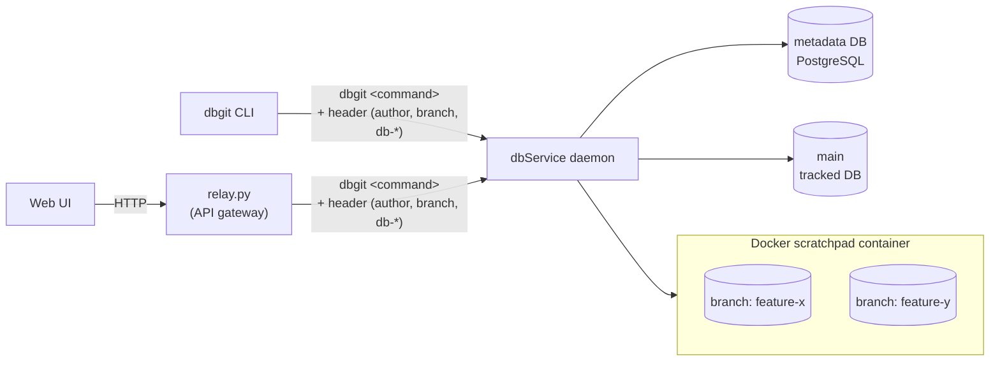
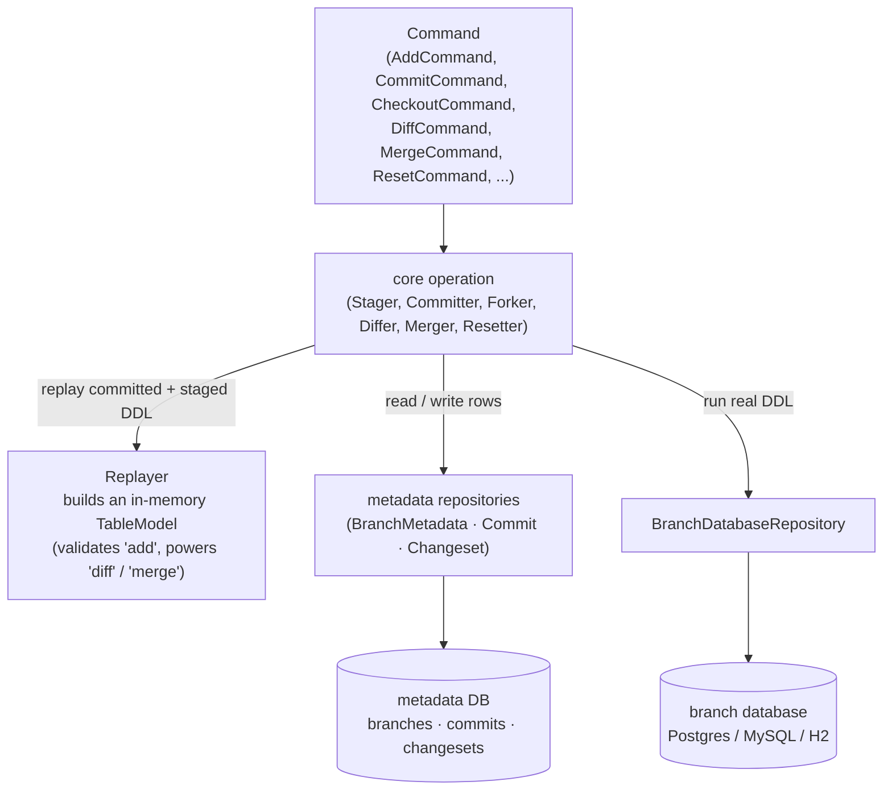
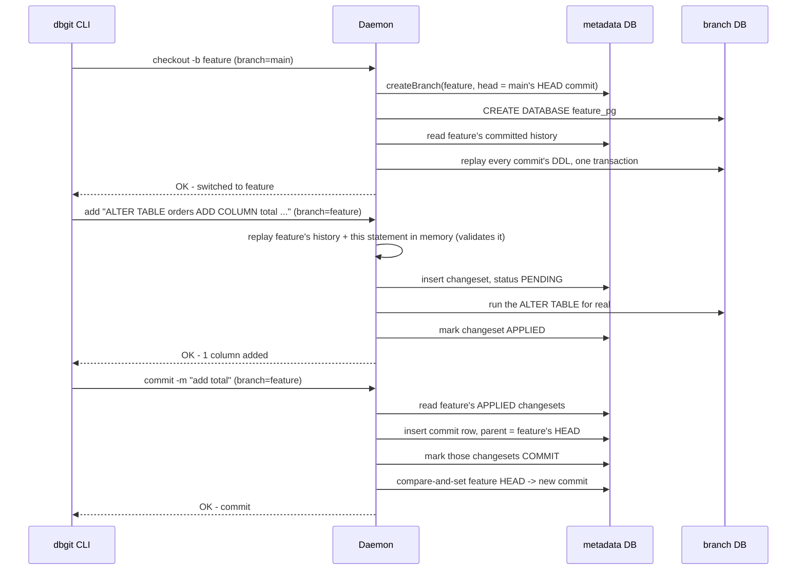

# Architecture

One daemon, many clients, no per-user state on the server.

Every socket carries one plain-text header line (`author=... branch=... db-host=...`, percent-encoded,
protocol tag `DBGIT/1`) in front of the same command line the CLI prints, e.g. `DBGIT/1 author=varun
branch=feature/orders db-host=localhost db-port=5432 db-database=app db-user=varun db-password=s3cret`
followed by `checkout -b feature/orders` on the next line — so nothing about who's asking or which
branch lives on the server between requests. The metadata DB is the only source of truth for what
branches and commits exist; every branch database (`main`'s tracked one included) is rebuilt from it
by replay, never read back into it. The web UI never talks to the daemon directly — `relay.py` is a
thin HTTP-to-TCP gateway in front of it, translating a JSON POST into that same header-plus-command-line
shape, since a browser can't open a raw socket.

## How a command runs

Every mutating command produces two effects that have to agree: an **in-memory replay** — what makes
`add` reject bad DDL up front, and what `diff`/`merge` compare — and a **real write**, split into the
metadata DB (bookkeeping rows: branches, commits, changesets) and the branch's actual database (real
DDL). A branch database is never read back into the model; the model only ever comes from replaying
recorded DDL.

Concretely, forking a branch, staging a change and committing it — `checkout -b`, `add`, `commit` —
looks like this:

The remaining commands are the same two effects in different order:

- **`diff a b`** (`Differ`) replays `a`'s history, `b`'s history, and the history they *share* — all
  three in memory, nothing touches a real database. Anything that differs between `a` and `b` but
  matches the shared ancestor is one side catching up; anything that differs from the ancestor on
  *both* sides is a conflict.
- **`merge b`** (`Merger`) runs that same `Differ` first. If nothing conflicts, it forks a throwaway
  staging branch and replays only `b`'s exclusive statements there for real — a rehearsal. Only once
  that succeeds does it replay the same statements against the target's real branch database, then
  writes one merge commit with both branches as parents, then drops the staging branch either way.
- **`reset <commit>`** (`Resetter`) replays the truncated history in memory first, so a broken history
  fails before anything is touched. Then, in one metadata transaction, it moves HEAD back and deletes
  the working set; only then — the one step that can't be transactional — does it drop and rebuild the
  real branch database from that same truncated history.

Why it is shaped this way — the daemon holding no per-user state (decision 3), locks taken per branch and in
a fixed order (decision 8), the metadata store as system of record (decision 1) — is argued in
[`decisions.md`](../decisions.md).

← [back to README](../README.md)
